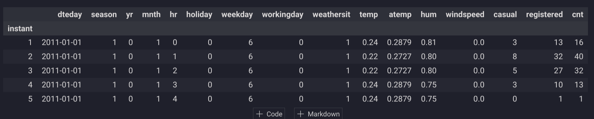

# 2.3. Datasets

## What are datasets?

[Datasets](https://en.wikipedia.org/wiki/Data_set) are collections of data typically structured in a tabular format, comprising rows and columns where each row represents an observation and each column represents a feature of the observation. They are the foundational elements upon which models are trained, tested, and validated, allowing for the extraction of insights, predictions, and understandings of underlying patterns.

Here's an example of how you can [load a dataset using pandas](https://pandas.pydata.org/docs/reference/frame.html) in a notebook:

```python
import pandas as pd
# Load the dataset into a pandas DataFrame
train = pd.read_csv('data/train.csv', index_col='Id')
# Display the shape of the dataset and its first few rows
print(train.shape)
train.head()
```



Datasets can originate from a wide range of sources including files (CSV, Excel, JSON, Parquet, Avro, ...), databases, and real-time data streams. They are essential for developing and testing machine learning models, conducting statistical analyses, and performing data visualization.

## What are key datasets properties in pandas?

When working with datasets in pandas, several key properties enable you to quickly inspect and understand the structure and content of your data. According to the pandas documentation, the main DataFrame attributes include:

- [`.shape`](https://pandas.pydata.org/docs/reference/api/pandas.DataFrame.shape.html#pandas.DataFrame.shape): Returns a tuple representing the dimensionality of the DataFrame.
- [`.dtypes`](https://pandas.pydata.org/docs/reference/api/pandas.DataFrame.dtypes.html#pandas.DataFrame.dtypes): Provides the data types of each column.
- [`.columns`](https://pandas.pydata.org/docs/reference/api/pandas.DataFrame.columns.html#pandas.DataFrame.columns): Gives an Index object containing column labels.
- [`.index`](https://pandas.pydata.org/docs/reference/api/pandas.DataFrame.index.html#pandas.DataFrame.index): Returns an Index object containing row labels.

These attributes and methods are invaluable for initial data exploration and integrity checks, facilitating a deeper understanding of the dataset's characteristics.

## Which file format should you use?

Choosing the right file format for your dataset is crucial, as it affects the efficiency of data storage, access, and processing. Consider the following criteria when selecting a file format:

1. **Orientation**:
    - **Row-Oriented** formats like CSV and Avro are preferable for transactional operations where row-level access is common.
    - **Column-Oriented** formats like Parquet and ORC are optimal for analytical querying, offering advantages in compression and read efficiency.
2. **Structure**:
    - **Flat** formats like CSV and Excel work well with tabular data and are straightforward to use with SQL queries and dataframes.
    - **Hierarchical** formats like JSON and XML are suitable for nested data structures, facilitating integration with document databases and APIs.
3. **Mode**:
    - **Textual** formats (e.g., CSV, JSON) are human-readable but require consideration for character encoding issues.
    - **Binary** formats (e.g., Parquet, Avro) offer superior speed and efficiency, making them suitable for larger datasets.
4. **Density**:
    - **Dense** formats store every data point explicitly
    - **Sparse** formats only store non-zero values, which can be more efficient for datasets with many missing values.

For data analytics workloads, we recommend using column-oriented, flat, binary format like the [Apache Parquet](https://parquet.apache.org/) format.

For machine learning modeling, we recommend using row-oriented, binary format based on your framework like [TFRecord for TensorFlow](https://www.tensorflow.org/tutorials/load_data/tfrecord) or [XGBoost DMatrix format](https://xgboost.readthedocs.io/en/stable/python/python_intro.html#data-interface).

## How can you optimize the dataset loading process?

Optimizing the dataset loading process involves several strategies:

- **Vectorization**: Utilize operations that apply to entire arrays or datasets at once, minimizing the use of slow Python loops.
- **Multi-core Processing**: Leverage libraries that can perform computations in parallel across multiple CPU cores.
- **Lazy Evaluation**: Use programming techniques or libraries that delay the computation until necessary, optimizing memory usage and computation time.
- **Distributed Computing**: For handling very large datasets, consider distributed computing frameworks that process data across multiple machines.

For large datasets, pandas might not be sufficient. Consider alternative libraries designed for handling large-scale data efficiently:

- **[Polars](https://pola.rs/)**: A Rust-based data processing library that is optimized for performance on a single machine and supports lazy operations.
- **[DuckDB](https://duckdb.org/)**: An in-process SQL OLAP database management system that excels in analytical query performance on a single machine.
- **[Spark](https://spark.apache.org/)**: A distributed computing system that provides comprehensive support for big data processing and analytics.

The **[Ibis project](https://ibis-project.org/)** unifies these alternatives under a common interface, allowing seamless transition between different backends based on the scale of your data and computational resources (e.g., using pandas for small datasets on a laptop and Spark for big data on clusters).

## Why do you need to split your dataset into 'X' and 'y'?

In [supervised learning](https://scikit-learn.org/stable/supervised_learning.html), the convention is to split the dataset into features (`X`) and the target variable (`y`). This separation is crucial because it delineates the input variables that the model uses to learn from the output variable it aims to predict. Structuring your data this way makes it clear to both the machine learning algorithms and the developers what the inputs and outputs of the models should be.

You can separate these using pandas in the following way:

```python
# Separate the dataset into features and target variable
X, y = train.drop('target', axis='columns'), train['target']
```

This practice lays the groundwork for model training and evaluation, ensuring that the algorithms have a clear understanding of the data they are working with.

## Do all datasets contain potential `X` and `y` variables?

Not all datasets contain distinct `X` (features) and `y` (target) variables. These are specific to [supervised learning](https://en.wikipedia.org/wiki/Supervised_learning). Other types of datasets and machine learning algorithms include:

- **[Time Series Forecasting](https://en.wikipedia.org/wiki/Time_series)**: Predicts future values of the same series without separate `y` targets.
- **[Unsupervised Learning](https://en.wikipedia.org/wiki/Unsupervised_learning)**: Like clustering, where data is grouped without predefined targets, or principal component analysis (PCA) which reduces dimensions without a target variable.
- **[Reinforcement Learning](https://en.wikipedia.org/wiki/Reinforcement_learning)**: Involves learning from the consequences of actions in an environment, focusing on maximizing rewards rather than predicting a target.
- **[Anomaly Detection](https://en.wikipedia.org/wiki/Anomaly_detection)**: Identifies unusual patterns or outliers without a specific target variable for training.

## Why should you split your dataset further into train/test sets?

Splitting your dataset into training and testing sets is essential for accurately evaluating the performance of your machine learning models. This approach allows you to:

- **Avoid Overfitting**: Ensuring that your model performs well not just on the data it was trained on, but also on new, unseen data.
- **Detect Underfitting**: Helping identify if the model is too simplistic to capture the underlying patterns in the data.

The [`train_test_split`](https://scikit-learn.org/stable/modules/generated/sklearn.model_selection.train_test_split.html) function from scikit-learn is commonly used for this purpose:

```python
from sklearn.model_selection import train_test_split
# Split the dataset into training and testing sets
X_train, X_test, y_train, y_test = train_test_split(X, y, test_size=0.2, random_state=42)
```

It's crucial to manage potential issues like data leakage, class imbalances, and the temporal nature of data to ensure the reliability of your model evaluations. For instance, the [Bike Sharing Demand dataset](https://www.kaggle.com/c/bike-sharing-demand) might use a [scikit-learn TimeSeriesSplit](https://scikit-learn.org/stable/modules/generated/sklearn.model_selection.TimeSeriesSplit.html) to take into account the forecasting aspects of the project.

## Do you need to shuffle your dataset prior to splitting it into train/test sets?

Whether to shuffle your dataset before splitting it into training and testing sets depends on the nature of your problem. For time-sensitive data, such as time series, shuffling could disrupt the temporal sequence, leading to misleading training data and inaccurate models. In such cases, maintaining the chronological order is critical.

For datasets where time or sequence does not impart any context to the data, shuffling helps to ensure that the training and testing sets are representative of the overall dataset, preventing any unintentional bias that might arise from the original ordering of the data. This is especially important in scenarios where the dataset may have been sorted or is not randomly distributed (e.g., sorted by price).

## Additional Resources

- **[Dataset example from the MLOps Python Package](https://github.com/fmind/mlops-python-package/blob/main/notebooks/prototype.ipynb)**
- [10 minutes to pandas](https://pandas.pydata.org/docs/user_guide/10min.html)
- [Scikit-learn dataset transformations](https://scikit-learn.org/stable/data_transforms.html)
- [Scikit-learn Datasets](https://scikit-learn.org/stable/datasets.html)
