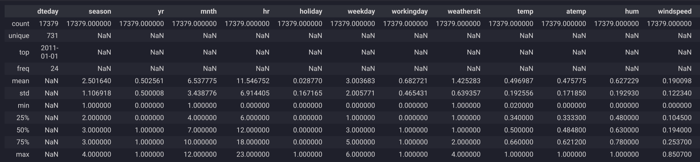
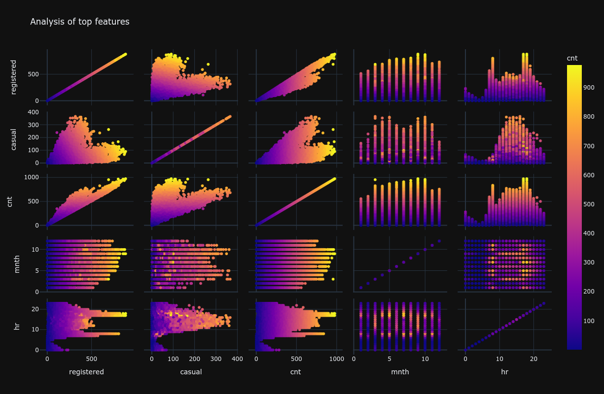

# 📈 2.4. Analysis

After loading our dataset, the next crucial step is to perform Exploratory Data Analysis (EDA). EDA is the process of investigating our dataset to discover patterns, spot anomalies, test hypotheses, and check assumptions with the help of summary statistics and graphical representations. It's about getting to know our data before we start modeling.

## 📊 Statistics

A great starting point for EDA is to compute descriptive statistics. This gives us a quantitative summary of our data.

```python
import pandas as pd

df = pd.read_csv("data/dataset.csv")
df.describe()
```



The `describe()` function provides the following key statistics for each numerical column:

-   **count**: The number of non-null observations.
-   **mean**: The average of the values.
-   **std**: The standard deviation, which measures the amount of variation or dispersion of a set of values.
-   **min**: The minimum value.
-   **25%**: The first quartile (Q1), or the 25th percentile.
-   **50%**: The median (Q2), or the 50th percentile.
-   **75%**: The third quartile (Q3), or the 75th percentile.
-   **max**: The maximum value.

By examining these statistics, we can quickly grasp the scale of each feature and identify potential outliers. For instance, a large difference between the mean and the median might suggest a skewed distribution.

## 🎨 Visualizations

While statistics give us a summary, visualizations help us see the story behind the numbers. A picture is worth a thousand words, especially in data analysis.

### Scatter Matrix

A scatter matrix (or pair plot) is a fantastic tool for visualizing the relationships between multiple variables at once. It creates a grid of scatter plots for each pair of variables, and the diagonal of the grid shows the distribution of each individual variable (often as a histogram or a Kernel Density Estimate plot).

```python
from pandas.plotting import scatter_matrix

scatter_matrix(df, alpha=0.2, figsize=(6, 6), diagonal="kde")
```



From a scatter matrix, we can quickly identify:
- **Correlations**: If the points in a scatter plot form a line, it indicates a linear relationship between the variables.
- **Distributions**: The diagonal plots show us the shape of each variable's distribution (e.g., normal, skewed, bimodal).
- **Outliers**: Points that fall far from the main cluster of points can be potential outliers.

### Correlation Heatmap

To get a more quantitative view of the correlations between variables, we can compute the correlation matrix and visualize it as a heatmap.

```python
import seaborn as sns
import matplotlib.pyplot as plt

correlation_matrix = df.corr()
plt.figure(figsize=(8, 6))
sns.heatmap(correlation_matrix, annot=True, cmap='coolwarm', fmt=".2f")
plt.title("Correlation Matrix")
plt.show()
```
*Note: You may need to install seaborn (`pip install seaborn`) and matplotlib (`pip install matplotlib`) if you don't have them already.*

A heatmap provides a clear, color-coded view of the strength and direction of correlations:
- **Positive Correlation (Warm Colors)**: As one variable increases, the other tends to increase.
- **Negative Correlation (Cool Colors)**: As one variable increases, the other tends to decrease.
- **No Correlation (Neutral Colors)**: No clear relationship between the variables.

## 🗑️ Handling Missing Values

Real-world datasets are often messy and may contain missing values. It's crucial to identify and handle them before modeling, as they can cause errors or lead to biased results.

First, let's check for missing values:
```python
df.isnull().sum()
```
This will show the number of missing values for each column.

If there are missing values, common strategies include:
- **Deletion**: Removing rows or columns with missing values. This is suitable if the amount of missing data is small.
- **Imputation**: Filling in the missing values. For numerical data, this could be the mean, median, or mode of the column. For categorical data, it's often the mode.

## 🔑 Key Takeaways

- **EDA is Fundamental**: Exploratory Data Analysis is a critical first step in any data science project.
- **Combine Statistics and Visuals**: Use both descriptive statistics (`.describe()`) and visualizations to get a comprehensive understanding of your data.
- **Visualize Relationships**: Scatter matrices and correlation heatmaps are powerful tools for uncovering relationships between variables.
- **Address Missing Data**: Always check for and handle missing values appropriately to ensure the quality of your analysis and models.
