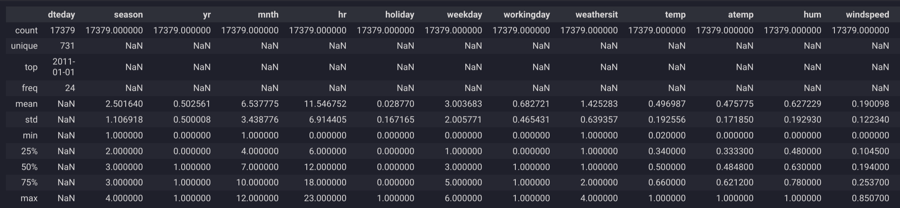
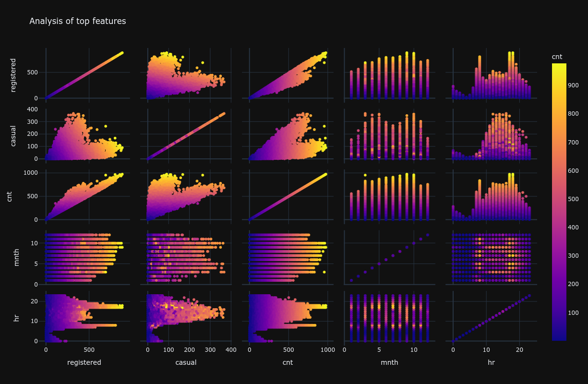

# 📈 2.4. Analysis

## ❓ What is Exploratory Data Analysis (EDA)?

[Exploratory Data Analysis (EDA)](https://en.wikipedia.org/wiki/Exploratory_data_analysis) is a critical first step in the data analysis process. It involves investigating and summarizing the main characteristics of a dataset, often using visual methods. The primary goal of EDA is to develop a deep understanding of the data's underlying structures, identify key variables, detect outliers and anomalies, uncover patterns, and test initial assumptions. This is achieved through a combination of statistical summaries and graphical representations.

EDA is not a rigid set of rules but rather a flexible, data-driven approach that encourages curiosity and exploration. It lays the groundwork for subsequent steps in a machine learning project, such as formulating hypotheses, defining a more targeted analysis, and selecting appropriate models and algorithms.

## 🐼 How can you use pandas to analyze your data?

Dataframe libraries like [Pandas](https://pandas.pydata.org/) are an essential tool for EDA in Python, offering a wide array of functions to quickly slice, dice, and summarize your data. To begin analyzing your dataset with pandas, you can use the following methods:

- [`.info()`](https://pandas.pydata.org/docs/reference/api/pandas.DataFrame.info.html): This method provides a concise summary of a DataFrame. It's the first thing you should run to get a quick overview of your data's structure. The output shows the number of entries, the column names, the number of non-null values per column, the data type of each column, and the memory usage. This is invaluable for quickly spotting columns with missing data and understanding the data types you're working with.
- [`.describe(include='all')`](https://pandas.pydata.org/docs/reference/api/pandas.DataFrame.describe.html): This method generates descriptive statistics that summarize the central tendency, dispersion, and shape of the dataset's distributions. By setting `include='all'`, you ensure that both numeric and categorical/object columns are included. For numerical columns, it provides metrics like mean, standard deviation, and quartiles. For object columns, it gives you the count, number of unique values, the most frequent value (top), and its frequency (freq).

Here’s how you might use these methods in practice:

```python
import pandas as pd
df = pd.read_csv('your_dataset.csv')

# Get a concise summary of the DataFrame
print("--- DataFrame Info ---")
df.info()

# Get descriptive statistics for all columns
print("\n--- Descriptive Statistics ---")
display(df.describe(include='all'))
```



These functions allow you to quickly assess the quality and characteristics of your data, facilitating the identification of areas that may require further investigation or preprocessing.

## 📊 How can you visualize patterns in your dataset?

Visualizing patterns in your dataset is pivotal for EDA, as it helps in recognizing underlying structures, trends, and outliers that might not be apparent from the raw data alone. Python offers a wealth of libraries for data visualization, including:

- **[Plotly Express](https://plotly.com/python/plotly-express/)**: A high-level interface for creating interactive and publication-quality graphs with concise syntax.
- **[Matplotlib](https://matplotlib.org/)**: The foundational library for creating static, animated, and interactive visualizations in Python. It offers a high degree of control over every aspect of a plot.
- **[Seaborn](https://seaborn.pydata.org/)**: Built on top of Matplotlib, Seaborn provides a high-level interface for drawing attractive and informative statistical graphics. It simplifies the creation of complex visualizations like heatmaps and pair plots.

For instance, [Plotly Express's `scatter_matrix`](https://plotly.com/python/splom/) can be utilized to explore relationships between multiple variables simultaneously. This is especially useful for getting a quick overview of how different numerical features relate to one another.

```python
import plotly.express as px
df = pd.read_csv('your_dataset.csv')
px.scatter_matrix(
    df, dimensions=["feature1", "feature2", "feature3"], color="target_variable",
    height=800, title="Scatter Matrix of Features"
)
```



This method enables the rapid exploration of pairwise relationships within a dataset, facilitating the identification of patterns, correlations, and potential hypotheses for deeper analysis.

## 🔬 Deeper Analysis: Correlation and Feature Relationships

While scatter matrices are great for visualizing relationships, a correlation matrix provides a quantitative measure of the linear relationship between numerical variables. The correlation coefficient ranges from -1 to 1:
-   **1**: Perfect positive correlation
-   **-1**: Perfect negative correlation
-   **0**: No linear correlation

You can easily compute the correlation matrix in pandas using the `.corr()` method. For a more intuitive visualization, a heatmap is an excellent choice.

```python
import seaborn as sns
import matplotlib.pyplot as plt

# Compute the correlation matrix
corr_matrix = df.corr()

# Plot the heatmap
plt.figure(figsize=(12, 9))
sns.heatmap(corr_matrix, annot=True, cmap='coolwarm', fmt=".2f")
plt.title('Correlation Matrix of Features')
plt.show()
```

By analyzing the heatmap, you can quickly identify which features are strongly correlated, which can be a crucial insight for feature selection and multicollinearity detection.

## 🤖 Is there a way to automate EDA?

Yes, there are libraries designed to automate the EDA process, significantly reducing the time and effort required to understand a dataset. One such library is **[ydata-profiling](https://docs.profiling.ydata.ai/latest/)**, which generates comprehensive and interactive HTML reports from a pandas DataFrame. These reports provide insights into:
- The distribution of each variable.
- Correlations between variables.
- Missing values.
- Potential data quality issues.

Example with ydata-profiling:

```python
from ydata_profiling import ProfileReport
df = pd.read_csv('your_dataset.csv')
profile = ProfileReport(df, title='Pandas Profiling Report', minimal=True)
profile.to_widgets()
```

While automated EDA tools like ydata-profiling are excellent for getting a quick and broad overview, they are not a complete substitute for manual EDA. Human intuition and domain expertise are crucial for asking the right questions, interpreting the results in context, and making informed decisions on how to proceed with the analysis. Therefore, automated EDA should be viewed as a powerful complement to, rather than a replacement for, traditional exploratory data analysis methods.

## 🗑️ How can you handle missing values in datasets?

Handling missing values in datasets is crucial for maintaining data integrity and ensuring the reliability of your analysis and models. Here are common methods:

1.  **Remove Data**: Delete rows or columns with missing values. This is a straightforward approach, but it should be used with caution. Deleting rows (`df.dropna(axis=0)`) is suitable if the number of affected rows is small. Deleting columns (`df.dropna(axis=1)`) is an option if a feature has a high percentage of missing values and is not critical for the analysis.
2.  **Impute Values**: Replace missing values with a statistical substitute. Common imputation techniques include replacing missing values with the mean, median, or mode of the column. More advanced methods use machine learning algorithms (like K-Nearest Neighbors) to predict the missing values based on other features.
3.  **Indicator Variables**: Create a new binary column that indicates whether the data was missing for a given observation. This allows a model to learn from the fact that the value was missing, which can sometimes be informative.

[MissingNo](https://github.com/ResidentMario/missingno) is an excellent tool for visualizing missing data in Python. It helps you understand the distribution of missing data at a glance.

To use it:

1.  **Install MissingNo**: `pip install missingno`
2.  **Import and Use**:

```python
import missingno as msno
import pandas as pd

data = pd.read_csv('your_data.csv')
msno.matrix(data)  # A matrix plot to visualize missing data patterns
msno.bar(data)     # A bar chart of non-missing values per column
```

These visualizations help identify patterns and distributions of missing data, aiding in effective preprocessing decisions.

## 🔑 Key Takeaways

-   **EDA is Fundamental**: Exploratory Data Analysis is a crucial first step to understand your data's structure, uncover patterns, and detect anomalies.
-   **Start with Summaries**: Use `df.info()` to check data types and null counts, and `df.describe()` to get a statistical summary of your data.
-   **Visualize Everything**: Visualizations are key to understanding distributions and relationships between variables. Use libraries like Plotly, Seaborn, and Matplotlib to create insightful plots.
-   **Quantify Relationships**: Use correlation matrices (`.corr()`) to quantify the linear relationships between numerical features.
-   **Automate When Possible**: Tools like `ydata-profiling` can accelerate the initial phase of EDA, but they don't replace the need for manual, context-aware analysis.
-   **Handle Missing Data Thoughtfully**: The strategy for handling missing data (removing, imputing, or flagging) depends on the context and the amount of missing information.

## 📚 Additional resources

- **[Example from the MLOps Python Package](https://github.com/fmind/mlops-python-package/blob/main/notebooks/prototype.ipynb)**
- [10 minutes to pandas](https://pandas.pydata.org/docs/user_guide/10min.html)
