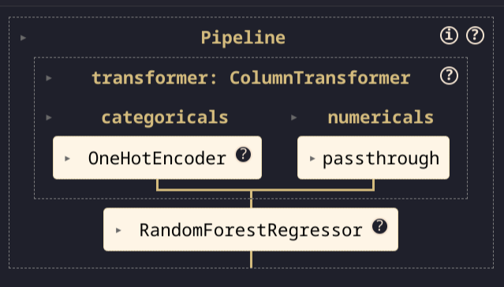

# 2.5. Modeling

## What are pipelines?

[Pipelines in machine learning](https://scikit-learn.org/stable/modules/compose.html#pipeline) provide a streamlined way to organize sequences of data preprocessing and modeling steps. They encapsulate a series of data transformations followed by the application of a model, facilitating both simplicity and efficiency in the development process. Pipelines can be broadly categorized as follows:

- **Model Pipeline**: Focuses specifically on sequences related to preparing data for machine learning models and applying these models. For instance, scikit-learn's [`Pipeline`](https://scikit-learn.org/stable/modules/compose.html#pipeline) class allows for chaining [preprocessors](https://scikit-learn.org/stable/modules/preprocessing.html) and [estimators](https://scikit-learn.org/stable/developers/develop.html).
- **Data Pipeline**: Encompasses a wider scope, including steps for data gathering, cleaning, and transformation. Tools such as [Prefect](https://www.prefect.io/) and [ZenML](https://docs.zenml.io/user-guide/starter-guide/create-an-ml-pipeline) offer capabilities for building comprehensive data pipelines.
- **Orchestration Pipeline**: Targets the automation of a series of tasks, including data and model pipelines, ensuring they execute in an orderly fashion or under specific conditions. Examples include [Apache Airflow](https://airflow.apache.org/) for creating directed acyclic graphs (DAGs) and [Vertex AI for managing ML workflows](https://cloud.google.com/vertex-ai/docs/pipelines/introduction).

For the purposes of this discussion, we'll focus on **model pipelines**, crucial for efficiently prototyping machine learning solutions. The code example are based on [scikit-learn pipeline](https://scikit-learn.org/stable/modules/generated/sklearn.pipeline.Pipeline.html), as this toolkit is simple to understand and its concept can be generalized to other types of pipeline like [Dagster](https://dagster.io/), [Prefect](https://www.prefect.io/), or [Metaflow](https://metaflow.org/).

Example of defining a pipeline in a notebook:

```python
from sklearn import pipeline, compose, preprocessing, ensemble

categoricals = [...] # List of categorical feature names
numericals = [...] # List of numerical feature names
RANDOM = 42 # Fixed random state for reproducibility
CACHE = './.cache' # Path for caching transformers

# Constructing a pipeline
draft = pipeline.Pipeline(
    steps=[
        ("transformer", compose.ColumnTransformer([
            ("categoricals", preprocessing.OneHotEncoder(
                sparse_output=False, handle_unknown="ignore"
            ), categoricals),
            ("numericals", "passthrough", numericals),
        ], remainder="drop")),
        ("regressor", ensemble.RandomForestRegressor(random_state=RANDOM)),
    ],
)
```



## Why do you need to use a pipeline?

Implementing pipelines in your machine learning projects offers several key advantages:

- **Prevents Data Leakage during preprocessing**: By ensuring data preprocessing steps are applied correctly during model training and validation, pipelines help maintain the integrity of your data.
- **Simplifies Cross-Validation and Hyperparameter Tuning**: Pipelines facilitate the application of transformations to data subsets appropriately during procedures like cross-validation, ensuring accurate and reliable model evaluation.
- **Ensures Consistency**: Pipelines guarantee that the same preprocessing steps are executed in both the model training and inference phases, promoting consistency and reliability in your ML workflow.

Pipelines thus represent an essential tool in the machine learning toolkit, streamlining the model development process and enhancing model performance and evaluation.

## Why do you need to process inputs by type?

Different data types typically require distinct preprocessing steps to prepare them effectively for machine learning models:

- **Numerical Features** may benefit from scaling or normalization to ensure that they're on a similar scale.
- **Categorical Features** often require encoding (e.g., OneHotEncoding) to transform them into a numerical format that models can understand.
- **Datetime Features** might be broken down into more granular components (e.g., year, month, day) to capture temporal patterns more effectively.

Utilizing [scikit-learn's `ColumnTransformer`](https://scikit-learn.org/stable/modules/generated/sklearn.compose.ColumnTransformer.html), you can specify different preprocessing steps for different columns of your data, ensuring that each type is handled appropriately.

Example of [selecting features by type from a Pandas DataFrame](https://pandas.pydata.org/docs/reference/api/pandas.DataFrame.select_dtypes.html):

```python
import pandas as pd

# Assume X_train is your training data stored in a Pandas DataFrame
num_features = X_train.select_dtypes(include=['number']).columns.tolist()
cat_features = X_train.select_dtypes(include=['object', 'category']).columns.tolist()
```

## What is the benefit of using a memory cache?

[Employing a memory cache with pipelines](https://scikit-learn.org/stable/modules/generated/sklearn.pipeline.Pipeline.html), such as the `memory` attribute in scikit-learn's `Pipeline`, offers significant performance benefits by caching the results of transformation steps. This approach is particularly advantageous during operations like grid search, where certain preprocessing steps are repeatedly executed across different parameter combinations. Caching can dramatically reduce computation time by avoiding redundant processing.

Example of utilizing a memory cache with a pipeline:

```python
from sklearn import pipeline, compose, preprocessing, ensemble

# Assuming 'categoricals' and 'numericals' are defined as before
CACHE = './.cache' # Directory for caching transformers

# Constructing the pipeline with caching enabled
draft = pipeline.Pipeline(
    steps=[
        ("transformer", compose.ColumnTransformer([
            ("categoricals", preprocessing.OneHotEncoder(
                sparse_output=False, handle_unknown="ignore"
            ), categoricals),
            ("numericals", "passthrough", numericals),
        ], remainder="drop")),
        ("regressor", ensemble.RandomForestRegressor(random_state=RANDOM)),
    ],
    memory=CACHE,
)
```

Even if you don't plan on using [scikit-learn pipeline abstraction](https://scikit-learn.org/stable/modules/generated/sklearn.pipeline.Pipeline.html), you can implement the same concept in your code base to obtain the same benefits.

## How can you change the pipeline hyper-parameters?

Adjusting hyper-parameters within a [scikit-learn pipeline](https://scikit-learn.org/stable/modules/generated/sklearn.pipeline.Pipeline.html) can be achieved using the `set_params` method or by directly accessing parameters via the double underscore (`__`) notation. This flexibility allows you to fine-tune your model directly within the pipeline structure.

Example of setting pipeline hyper-parameters:

```python
from sklearn.pipeline import Pipeline
from sklearn import preprocessing, ensemble

# Assume 'RANDOM_STATE' and 'PARAM_GRID' are defined
pipeline = Pipeline([
    ('encoder', preprocessing.OneHotEncoder()),
    ('regressor', ensemble.RandomForestRegressor(random_state=RANDOM_STATE))
])

# Adjusting hyper-parameters using 'set_params'
pipeline.set_params(regressor__n_estimators=100, regressor__max_depth=10)
```

## Why do you need to perform a grid search with your pipeline?

Conducting [a grid search over a pipeline](https://scikit-learn.org/stable/modules/generated/sklearn.model_selection.GridSearchCV.html) is crucial for identifying the optimal combination of model hyper-parameters. This exhaustive search evaluates various parameter combinations across your dataset, using cross-validation to ensure robust assessment of model performance.

Example of performing grid search with a pipeline:

```python
from sklearn.model_selection import GridSearchCV
from sklearn import model_selection

CV = 5
SCORING = 'neg_mean_squared_error'
PARAM_GRID = {
    "regressor__max_depth": [15, 20, 25],
    "regressor__n_estimators": [150, 200, 250],
}
RANDOM_STATE = 0

splitter = model_selection.TimeSeriesSplit(n_splits=CV)

search = GridSearchCV(
    estimator=draft, cv=splitter, param_grid=PARAM_GRID, scoring=SCORING, verbose=1
)
search.fit(inputs_train, targets_train)
```

## Why do you need to perform cross-validation with your pipeline?

[Cross-validation](https://en.wikipedia.org/wiki/Cross-validation_(statistics)) is a fundamental technique in the validation process of machine learning models, enabling you to assess how well your model is likely to perform on unseen data. By integrating cross-validation into your pipeline, you can ensure a thorough evaluation of your model's performance, mitigating the risk of overfitting and underfitting.

When utilizing [`GridSearchCV` from scikit-learn for hyperparameter tuning](https://scikit-learn.org/stable/modules/generated/sklearn.model_selection.GridSearchCV.html), the `cv` parameter plays a crucial role in defining the cross-validation splitting strategy. This flexibility allows you to tailor the cross-validation process to the specific needs of your dataset and problem domain, ensuring that the model evaluation is both thorough and relevant.

Here’s a breakdown of how you can control the cross-validation behavior through the `cv` parameter:

- **`None`**: By default, or when `cv` is set to `None`, GridSearchCV employs a 5-fold cross-validation strategy. This means the dataset is divided into 5 parts, with the model being trained on 4 parts and validated on the 1 remaining part in each iteration.

- **Integer**: Specifying an integer for `cv` changes the number of folds in a K-Fold (or StratifiedKFold for classification tasks) cross-validation. For example, `cv=10` would perform a 10-fold cross-validation, offering a more thorough validation at the cost of increased computational time.

- **CV Splitter**: scikit-learn provides several splitter classes (e.g., `KFold`, `StratifiedKFold`, `TimeSeriesSplit`) that can be used to define more complex cross-validation strategies. Passing an instance of one of these splitters to `cv` allows for customized dataset splitting that can account for factors like class imbalance or temporal dependencies.

- **Iterable**: An iterable yielding train/test splits as arrays of indices directly specifies the data partitions for each fold. This option offers maximum flexibility, allowing for completely custom splits based on external logic or considerations (e.g., predefined groups or stratifications not captured by the standard splitters).

## Do you need to retrain your pipeline? Should you use the full dataset?

After identifying the best model and hyper-parameters through grid search and cross-validation, it's common practice to retrain your model on the entire dataset. This approach allows you to leverage all available data, maximizing the model's learning and potentially enhancing its performance when making predictions on new, unseen data.

Retraining your model on the full dataset takes advantage of the insights gained during the model selection process, ensuring that the final model is as robust and well-tuned as possible.

Example of retraining your pipeline on the full dataset:

```python
# Assuming 'search' is your GridSearchCV object and 'X', 'y' are your full dataset
final_model = search.best_estimator_
final_model.fit(X, y)
```

Alternatively, if you've used [`GridSearchCV`](https://scikit-learn.org/stable/modules/generated/sklearn.model_selection.GridSearchCV.html) with `refit=True` (which is the default setting), the best estimator is automatically refitted on the whole dataset provided to `fit`, making it ready for use immediately after grid search:

```python
# 'search' has been conducted with refit=True
final_model = search.best_estimator_
```

In this way, the final model embodies the culmination of your exploratory work, tuned hyper-parameters, and the comprehensive learning from the entire dataset, positioning it well for effective deployment in real-world applications.

It's important to note, however, that while retraining on the full dataset can improve performance, it also eliminates the possibility of evaluating the model on unseen data unless additional, separate validation data is available. Therefore, the decision to retrain should be made with consideration of how model performance will be assessed and validated post-retraining.

## Modeling additional resources

- **[Example from the MLOps Python Package](https://github.com/fmind/mlops-python-package/blob/main/notebooks/prototype.ipynb)**
- [Supervised learning](https://scikit-learn.org/stable/supervised_learning.html)
- [Unsupervised learning](https://scikit-learn.org/stable/unsupervised_learning.html)
- [HuggingFace Models](https://huggingface.co/models)
- [Kaggle Models](https://www.kaggle.com/models)
