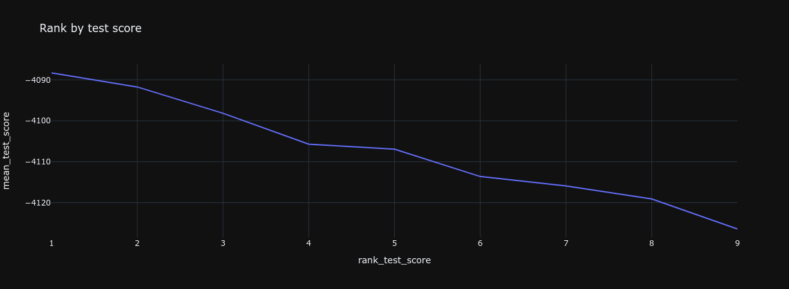
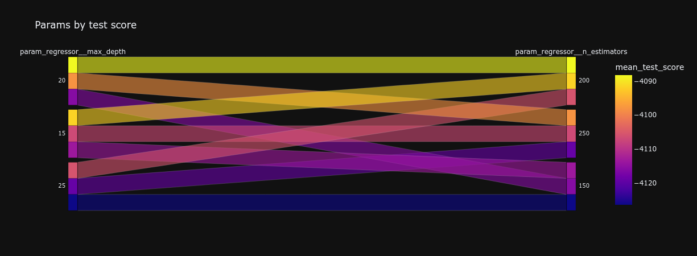
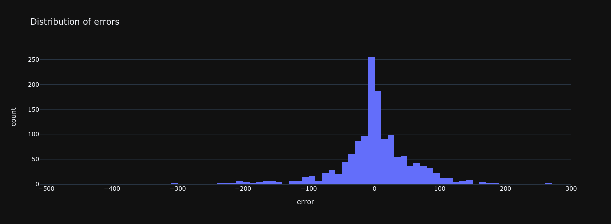
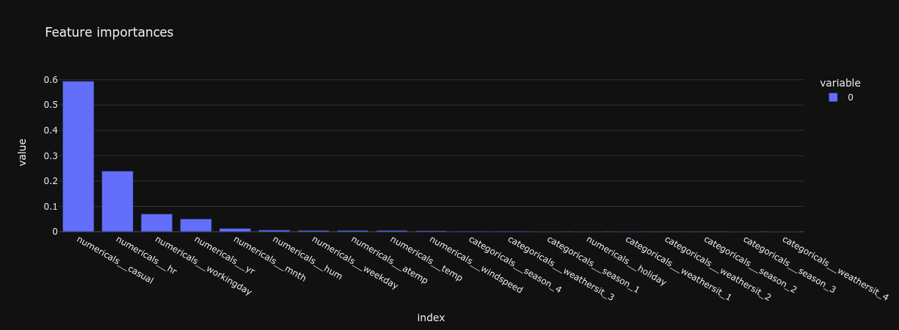
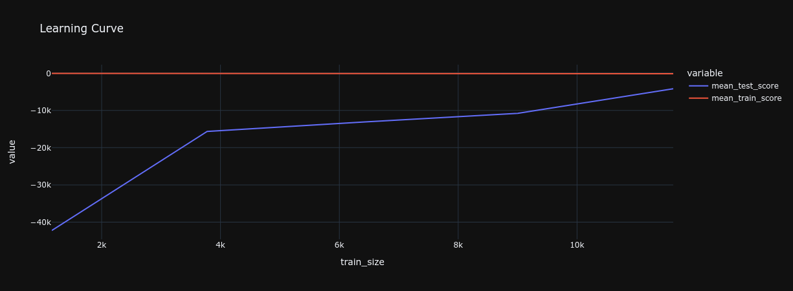
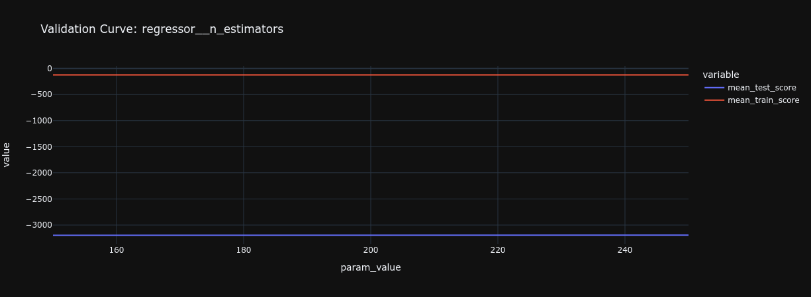

# 2.6. Evaluations

## What is an evaluation?

[Model evaluation](https://www.geeksforgeeks.org/machine-learning-model-evaluation/) is a fundamental step in the machine learning workflow that involves assessing a model's predictions to ensure its reliability and accuracy before deployment. It acts as a quality assurance mechanism, providing insights into the model's performance through various means such as error metrics, graphical representations (like validation curves), and more. This step is crucial for verifying that the model performs as expected and is suitable for real-world applications.

## Why should you evaluate your pipeline?

Machine learning models can sometimes behave in unpredictable ways due to their inherent complexity. By evaluating your training pipeline, you can uncover issues like data leakage, which undermines the model's ability to generalize to unseen data. Rigorous evaluation builds trust and credibility, ensuring that the model's performance is genuinely robust and not just a result of overfitting or other biases.

For more insights on data leakage, explore this link: [Data Leakage in Machine Learning](https://en.wikipedia.org/wiki/Leakage_(machine_learning)).

## How can you generate predictions with your pipeline?

To generate predictions using your machine learning pipeline, employ the hold-out dataset (test set). This approach ensures that the predictions are made on data that the model has not seen during training, providing a fair assessment of its generalization capability. Here's how you can do it:

```python
# Generate predictions
predictions = pd.Series(final.predict(inputs_test), index=inputs_test.index)
print(predictions.shape)
predictions.head()
```

Also, leverage the insights from your hyperparameter tuning process to understand the effectiveness of various configurations:

```python
# Analyze hyperparameter tuning results
results = pd.DataFrame(search.cv_results_)
results = results.sort_values(by="rank_test_score")
results.head()
```

## What do you need to evaluate in your pipeline?

Evaluating your training pipeline encompasses several key areas:

### Ranks

When analyzing the outcomes of hyperparameter tuning, focus on:

- Identifying ineffective hyperparameter combinations to eliminate.
- Determining if the best hyperparameters are outliers or represent a common trend.

This helps in deciding whether to expand or narrow the search space for optimal parameters.

**Example**:

```python
# Visualize rank by test score
px.line(results, x="rank_test_score", y="mean_test_score", title="Rank by test score")
```



### Params

Investigate which hyperparameters lead to better performance by:

- Spotting trends that suggest optimal settings.
- Identifying hyperparameters with minimal impact, which could be omitted.

This enables pinpointing the most effective hyperparameters for your specific problem.

**Example**:

```python
# Visualize hyperparameter impact
dimensions = [col for col in results.columns if col.startswith("param_")]
px.parallel_categories(results, dimensions=dimensions, color="mean_test_score", title="Params by test score")
```



### Predictions

Examine the distribution and balance of prediction values, ensuring they align with your training set's characteristics. A similar distribution and balance indicate that your model is generalizing well.

**Example with a single metric**:

```python
# Calculate a performance metric
score = metrics.mean_squared_error(y_test, y_pred)
score
```

**Example with a distribution**:

```python
# Visualize distribution of errors
px.histogram(errors, x="error", title="Distribution of errors")
```



### Feature Importances

Understanding which features most significantly influence your model's predictions can streamline the model by removing non-essential features. This analysis is more straightforward in models based on linear and tree structures.

**Example**:

```python
# Determine feature importances
importances = pd.Series(
    final.named_steps["regressor"].feature_importances_,
    index=final[:-1].get_feature_names_out(),
).sort_values(ascending=False)
print(importances.shape)
importances.head()
```



## How can you ensure your pipeline was trained on enough data?

Employing a [learning curve](https://scikit-learn.org/stable/modules/generated/sklearn.model_selection.learning_curve.html) analysis helps you understand the relationship between the amount of training data and model performance. Continue adding diverse data until the model's performance stabilizes, indicating an optimal data volume has been reached.

**Example using [scikit-learn's learning curve](https://scikit-learn.org/stable/modules/generated/sklearn.model_selection.learning_curve.html**:

```python
# Analyze learning curve
train_size, train_scores, test_scores = model_selection.learning_curve(
    final, inputs, targets, cv=splitter, scoring=SCORING, random_state=RANDOM,
)
learning = pd.DataFrame(
    {
        "train_size": train_size,
        "mean_test_score": test_scores.mean(axis=1),
        "mean_train_score": train_scores.mean(axis=1),
    }
)
px.line(learning, x="train_size", y=["mean_test_score", "mean_train_score"], title="Learning Curve")
```



## How can you ensure your pipeline captures the right level of complexity?

To balance complexity and performance, use [validation curves](https://scikit-learn.org/stable/modules/generated/sklearn.model_selection.validation_curve.html) to see how changes in a model parameter (like depth) affect its performance. Adjust complexity to improve performance without causing overfitting.

**Example with [scikit-learn's validation curve](https://scikit-learn.org/stable/modules/generated/sklearn.model_selection.validation_curve.html)**:

```python
# Explore validation curves for different parameters
for param_name, param_range in PARAM_GRID.items():
    print(f"Validation Curve for: {param_name} -> {param_range}")
    train_scores, test_scores = model_selection.validation_curve(
        final, inputs, targets, cv=splitter, scoring=SCORING,
        param_name=param_name, param_range=param_range,
    )
    validation = pd.DataFrame(
        {
            "param_value": param_range,
            "mean_test_score": test_scores.mean(axis=1),
            "mean_train_score": train_scores.mean(axis=1),
        }
    )
    px.line(
        validation, x="param_value", y=["mean_test_score", "mean_train_score"], title=f"Validation Curve: {param_name}"
    )
```



## Evaluations additional resources

- **[Example from the MLOps Python Package](https://github.com/fmind/mlops-python-package/blob/main/notebooks/prototype.ipynb)**
- [Data Leakage in Machine Learning](https://en.wikipedia.org/wiki/Leakage_(machine_learning)).
- [Model selection and evaluation](https://scikit-learn.org/stable/model_selection.html)
