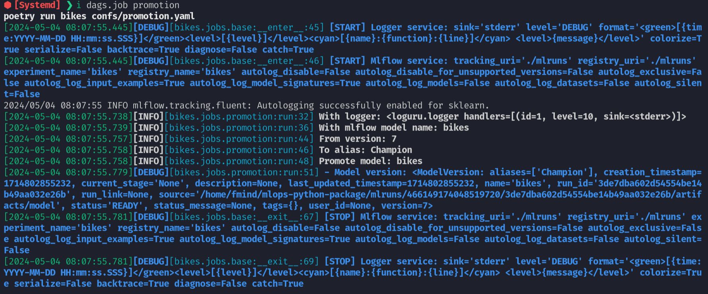

# 4.3. Logging

## What is software Logging?

[Logging](https://en.wikipedia.org/wiki/Logging_(computing)) is a crucial process in software development, involving the recording of events, operations, and errors that occur within a software application. This process is instrumental in understanding how a program operates and in identifying any problems that may arise. Logging can be accomplished using dedicated logging modules provided by programming languages or through simple mechanisms like print statements.

Every program has access to two primary channels for communication:

- **[Standard Output (stdout)](https://en.wikipedia.org/wiki/Standard_streams#Standard_output_(stdout))**: This is used for general program output, such as results of operations or status messages. In Python, this can be accessed via [`sys.stdout`](https://docs.python.org/3/library/sys.html#sys.stdout).
- **[Standard Error (stderr)](https://en.wikipedia.org/wiki/Standard_streams#Standard_error_(stderr))**: This channel is reserved for reporting errors and diagnostic messages. It ensures that error messages are kept separate from the main program output, allowing for easier debugging. In Python, [`sys.stderr`](https://docs.python.org/3/library/sys.html#sys.stderr) is used for this purpose.

To facilitate logging, developers can choose from various [logging levels](https://docs.python.org/3/library/logging.html#logging-levels), allowing them to categorize messages by their severity or importance. These levels include:

- **DEBUG**: Detailed information, typically of interest only when diagnosing problems.
- **INFO**: Confirmation that things are working as expected.
- **WARNING**: An indication that something unexpected happened, or indicative of some problem in the near future (e.g., ‘disk space low’). The software is still working as expected.
- **ERROR**: Due to a more serious problem, the software has not been able to perform some function.
- **CRITICAL**: A serious error, indicating that the program itself may be unable to continue running.

## Why is Logging Important in Python Projects?

Logging plays a vital role in both the development and production phases of software projects for several reasons:

- **Debugging**: It facilitates the identification and resolution of issues in the code.
- **Monitoring**: Logging allows for the ongoing observation of application behavior and performance, crucial for maintaining operational stability.
- **Audit Trails**: Logs serve as a historical record of events, which can be critical for tracing the sequence of actions leading up to a problem.
- **Documentation**: They act as a live form of documentation that details the runtime behavior of an application.

Given the myriad of things that can go wrong during program execution – such as missing files, full disk space, or network connectivity issues – having detailed logs can make the difference between quickly resolving an issue and a prolonged downtime.

## Which tool should you use to log in Python?

Python's standard library includes a robust but somewhat complex [`logging` module](https://docs.python.org/3/library/logging.html). For those seeking simplicity without sacrificing power, the [`loguru`](https://loguru.readthedocs.io/) library is an excellent alternative. It streamlines the logging process with an easier syntax and a host of convenient features, such as automatic file rotation and structured logging. Below is how you can install and use `loguru`:

```python
from loguru import logger

# logging example for the inference job
def run(self)
    # services
    logger = self.logger_service.logger()
    logger.info("With logger: {}", logger)
    # inputs
    logger.info("Read inputs: {}", self.inputs)
    inputs_ = self.inputs.read()  # unchecked!
    inputs = schemas.InputsSchema.check(inputs_)
    logger.debug("- Inputs shape: {}", inputs.shape)
    # model
    logger.info("With model: {}", self.mlflow_service.registry_name)
    model_uri = registries.uri_for_model_alias_or_version(
        name=self.mlflow_service.registry_name,
        alias_or_version=self.alias_or_version,
    )
    logger.debug("- Model URI: {}", model_uri)
    # loader
    logger.info("Load model: {}", self.loader)
    model = self.loader.load(uri=model_uri)
    logger.debug("- Model: {}", model)
    # outputs
    logger.info("Predict outputs: {}", len(inputs))
    outputs = model.predict(inputs=inputs)  # checked
    logger.debug("- Outputs shape: {}", outputs.shape)
    # write
    logger.info("Write outputs: {}", self.outputs)
    self.outputs.write(data=outputs)
    # notify
    self.alerts_service.notify(
        title="Inference Job Finished", message=f"Outputs Shape: {outputs.shape}"
    )
    return locals()
```

The above example demonstrates the simplicity of using `loguru` for logging across various severity levels, from debugging information to error reporting, directly to standard error (stderr) by default.



## How can you configure loguru?

Configuring [`loguru`](https://loguru.readthedocs.io/) in your Python applications is straightforward. You can adjust settings either directly in your code or through a configuration file. Here's an example of how `loguru` can be configured in a Python project:

```python
import pydantic as pdt

class LoggerService(Service):
    """Service for logging messages.

    https://loguru.readthedocs.io/en/stable/api/logger.html

    Parameters:
        sink (str): logging output.
        level (str): logging level.
        format (str): logging format.
        colorize (bool): colorize output.
        serialize (bool): convert to JSON.
        backtrace (bool): enable exception trace.
        diagnose (bool): enable variable display.
        catch (bool): catch errors during log handling.
    """

    sink: str = "stderr"
    level: str = "DEBUG"
    format: str = (
        "<green>[{time:YYYY-MM-DD HH:mm:ss.SSS}]</green>"
        "<level>[{level}]</level>"
        "<cyan>[{name}:{function}:{line}]</cyan>"
        " <level>{message}</level>"
    )
    colorize: bool = True
    serialize: bool = False
    backtrace: bool = True
    diagnose: bool = False
    catch: bool = True

    @T.override
    def start(self) -> None:
        loguru.logger.remove()
        config = self.model_dump()
        # use standard sinks or keep the original
        sinks = {"stderr": sys.stderr, "stdout": sys.stdout}
        config["sink"] = sinks.get(config["sink"], config["sink"])
        loguru.logger.add(**config)

    def logger(self) -> loguru.Logger:
        """Return the main logger.

        Returns:
            loguru.Logger: the main logger.
        """
        return loguru.logger
```

This example outlines a configurable logging service, illustrating how `loguru` can be tailored to meet the specific needs of an application, from adjusting the logging level to formatting messages.

## What are best practices for logging in Python?

1. **Use Appropriate Logging Levels**: Choose the right level for each log statement to ensure the log output is relevant and useful.
2. **Provide Contextual Information**: Enhance log messages with context to make them more informative and easier to understand.
3. **Protect Sensitive Information**: Avoid logging sensitive data to safeguard privacy and security.
4. **Maintain Consistent Formatting**: Standardize log message formats to simplify parsing and analysis.
5. **Control Log File Size**: Implement strategies like log rotation to manage file sizes and prevent excessive disk space usage.
6. **Embrace Asynchronous Logging**: For performance-sensitive applications, consider asynchronous logging to minimize impact on application throughput.
7. **Centralize Logs for Distributed Systems**: Aggregate logs from multiple sources to facilitate comprehensive monitoring and analysis.
8. **Utilize Structured Logging**: Employ structured formats (e.g., JSON) for complex applications to make logs more queryable and machine-readable.
9. **Regularly Review Logging Configuration**: Ensure your logging setup remains effective and adjust as necessary to capture critical information.
10. **Educate Your Team**: Promote awareness and understanding of logging best practices among all team members to enhance the quality and consistency of application logs.

Implementing these practices will help maximize the benefits of logging in your Python projects, providing clear insights into application behavior and aiding in rapid problem resolution.

## Logging additional resources

- **[Logging example from the MLOps Python Package](https://github.com/fmind/mlops-python-package/blob/main/src/bikes/jobs/training.py)**
- [A Complete Guide to Logging in Python with Loguru](https://betterstack.com/community/guides/logging/loguru/)
- [Logging in Python](https://realpython.com/python-logging/)
- [Python Logging: A Stroll Through the Source Code](https://realpython.com/python-logging-source-code/)
