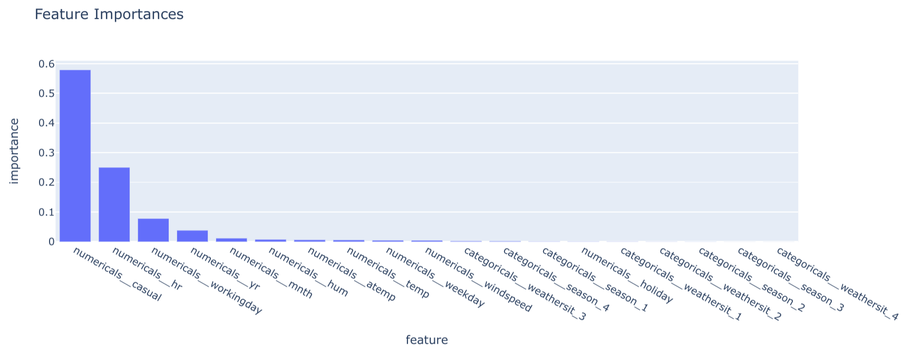
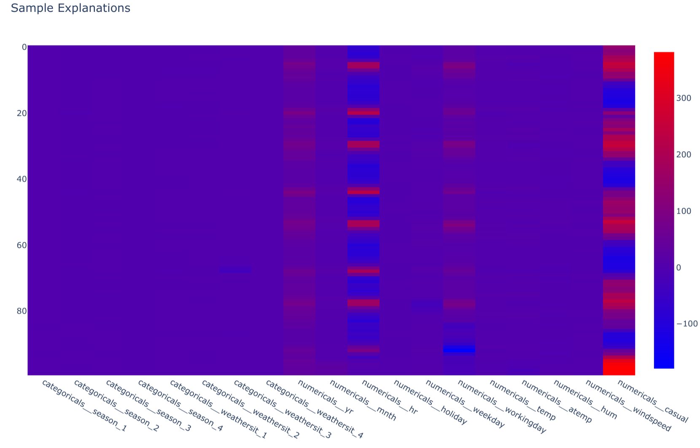

# 7.5. Explainability

## What is Explainability in AI/ML?

[Explainability in Artificial Intelligence and Machine Learning (AI/ML)](https://christophm.github.io/interpretable-ml-book/) refers to the ability to understand and interpret the reasoning behind a model's predictions or decisions. It's a crucial aspect of responsible AI, particularly as models become more complex and their applications extend to critical domains such as healthcare, finance, and law. Explainability promotes transparency, accountability, and trust in AI systems by making their internal workings accessible to humans, enabling better evaluation of their fairness, bias, and potential risks.

## Why do you need Explainability in AI/ML?

- **Build trust in AI systems**: Explainable AI promotes confidence in model predictions by providing insights into the factors influencing decisions.
- **Identify and mitigate bias**:  Explainability allows for the detection and correction of biases that may be embedded in data or amplified by models.
- **Improve model debugging and development**: Understanding how a model works can aid in identifying errors or improving its performance.
- **Meet regulatory requirements**: In regulated industries like banking and insurance, explainability is crucial for demonstrating compliance with fair lending or insurance practices.

## What is the difference between Local and Global Explainability?

Explainability methods can be broadly categorized into two types based on their scope of interpretation:

- **[Local Explainability](https://censius.ai/blogs/global-local-cohort-explainability#blogpost-toc-13)**: Focuses on understanding individual predictions, providing insights into the specific factors influencing a single output. This approach answers questions like "Why was this loan application rejected?" or "Why did the model predict this patient is at high risk?"
  - **Example**: [SHAP (SHapley Additive exPlanations)](https://shap.readthedocs.io/en/latest/) is a widely used technique for local explainability. It assigns a contribution score to each feature for a given prediction, quantifying how each feature influences the outcome.
- **[Global Explainability](https://censius.ai/blogs/global-local-cohort-explainability#blogpost-toc-11)**: Seeks to understand the overall behavior of the model, providing insights into the general relationship between input features and predictions across the entire dataset. This helps answer questions such as "Which features are most important for the model's predictions overall?" or "How does the model generally behave for different customer segments?"
  - **Example**: Model feature importance scores, often provided by tree-based models or linear models, represent a form of global explainability. These scores indicate the relative influence of each feature on the model's predictions, averaged across the entire dataset.

Choosing between local and global explainability depends on the specific goals and questions you are trying to answer. In some scenarios, you might require both types of explanations to gain a complete understanding of your model's behavior and its predictions.

## How can you implement Explainability with SHAP and other AI/ML frameworks?

The [MLOps Python Package](https://github.com/fmind/mlops-python-package) integrates [SHAP (SHapley Additive exPlanations)](https://shap.readthedocs.io/en/latest/) to provide local explainability and [Random Forest feature importances](https://scikit-learn.org/stable/modules/generated/sklearn.ensemble.RandomForestRegressor.html) for global explainability. It includes a dedicated job, [`ExplanationsJob`](https://github.com/fmind/mlops-python-package/blob/main/src/bikes/jobs/explanations.py), that generates explanations for a registered model using a sample of data inputs.

Here's how the package implements explainability:

1. **[`explain_model()`](https://github.com/fmind/mlops-python-package/blob/main/src/bikes/core/models.py)**: This method, defined within the `Model` abstract base class in `bikes.core.models`, is responsible for providing global explainability. For the `BaselineSklearnModel`, it leverages the `feature_importances_` attribute of the underlying RandomForestRegressor to generate a DataFrame outlining feature importances.

    ```python
    class BaselineSklearnModel(Model):
        # ... (other methods)

        @T.override
        def explain_model(self) -> schemas.FeatureImportances:
        model = self.get_internal_model()
        regressor = model.named_steps["regressor"]
        transformer = model.named_steps["transformer"]
        feature = transformer.get_feature_names_out()
        feature_importances = schemas.FeatureImportances(
            data={
                "feature": feature,
                "importance": regressor.feature_importances_,
            }
        )
        return feature_importances
    ```



2. **[`explain_samples()`](https://github.com/fmind/mlops-python-package/blob/main/src/bikes/core/models.py)**: This method, also within the `Model` base class, focuses on local explainability. For `BaselineSklearnModel`, it utilizes a SHAP TreeExplainer to compute SHAP values for a given set of input samples. These values are then stored in a DataFrame, enabling analysis of feature contributions to individual predictions.

    ```python
    class BaselineSklearnModel(Model):
        # ... (other methods)

        @T.override
        def explain_samples(self, inputs: schemas.Inputs) -> schemas.SHAPValues:
        model = self.get_internal_model()
        regressor = model.named_steps["regressor"]
        transformer = model.named_steps["transformer"]
        transformed = transformer.transform(X=inputs)
        explainer = shap.TreeExplainer(model=regressor)
        shap_values = schemas.SHAPValues(
            data=explainer.shap_values(X=transformed),
            columns=transformer.get_feature_names_out(),
        )
        return shap_values
    ```



3. **[`ExplanationsJob`](https://github.com/fmind/mlops-python-package/blob/main/src/bikes/jobs/explanations.py)**: This job, defined in `bikes.jobs.explanations`, orchestrates the process of generating explanations. It loads a registered model from MLflow, reads a sample of data, computes both model-level and sample-level explanations, and then writes these explanations to Parquet files.

    ```python
    class ExplanationsJob(base.Job):
        # ... (other attributes)

        def run(self):
            # ... (logic for loading model, reading data, and generating explanations)
            # - models
            logger.info("Explain model: {}", model)
            models_explanations = model.explain_model()
            logger.debug("- Models explanations shape: {}", models_explanations.shape)
            # - samples
            logger.info("Explain samples: {}", len(inputs_samples))
            samples_explanations = model.explain_samples(inputs=inputs_samples)
            logger.debug("- Samples explanations shape: {}", samples_explanations.shape)
            # ... (write explanations to files)
    ```

### Integrating Explainability into Your Workflow

You can incorporate explainability into your MLOps workflow by executing the [`ExplanationsJob`](https://github.com/fmind/mlops-python-package/blob/main/src/bikes/jobs/explanations.py) after model training or deployment. The resulting explanation files can then be used for various purposes:

- **Model Understanding**: Analyze feature importances to understand the key drivers of the model's predictions.
- **Bias Detection**: Identify features that disproportionately influence predictions for specific groups or categories.
- **Debugging and Improvement**: Gain insights into individual predictions that may be erroneous or unexpected, guiding model refinements.
- **Communication with Stakeholders**: Present explanations to business users or regulators to build trust and transparency in model decisions.

## Which sectors are impacted by Explainable AI?

Explainable AI is especially relevant in sectors where the consequences of model decisions are significant or where regulatory compliance mandates transparency and accountability:

- **Banking and Finance**: For applications such as loan approvals, credit scoring, or fraud detection, explainability helps ensure fairness and avoid discriminatory practices.
- **Insurance**: Explainable AI is crucial for setting premiums, assessing risk, and handling claims in a way that is transparent and justifiable.
- **Healthcare**: For medical diagnosis, treatment recommendations, or patient risk assessment, explainable AI promotes trust and understanding of model-driven decisions.
- **Law Enforcement**: In scenarios where AI is used for predictive policing or criminal justice applications, explainability is crucial for ethical and legal considerations.

## Explainability Additional Resources

- **[Explainability example from the MLOps Python Package](https://github.com/fmind/mlops-python-package/blob/main/src/bikes/jobs/explanations.py)**
- [SHAP (SHapley Additive exPlanations)](https://shap.readthedocs.io/en/latest/)
- [LIME (Local Interpretable Model-agnostic Explanations)](https://github.com/marcotcr/lime)
- [Interpretable Machine Learning: A Guide for Making Black Box Models Explainable](https://christophm.github.io/interpretable-ml-book/)
- [Explainable AI (XAI): Concepts, Taxonomies, Opportunities and Challenges toward Responsible AI](https://arxiv.org/abs/1910.10045)
