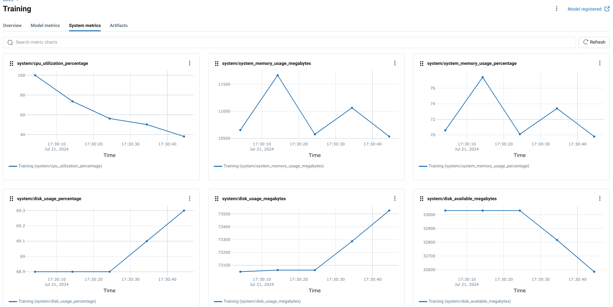

# 7.6. Infrastructure

## What is Infrastructure Monitoring in MLOps?

[Infrastructure Monitoring in MLOps](https://cloud.google.com/architecture/mlops-continuous-delivery-and-automation-pipelines-in-machine-learning) involves the continuous tracking and analysis of hardware resources and their performance metrics during the execution of machine learning workloads. This encompasses a range of aspects including CPU utilization, memory consumption, network bandwidth usage, disk I/O, and GPU performance (if applicable). The data collected from infrastructure monitoring provides valuable insights into the efficiency and stability of your MLOps pipeline.

## Why do you need Infrastructure Monitoring for AI/ML?

Monitoring the performance and utilization of your hardware infrastructure is crucial for several reasons:

- **Resource Optimization**: Identify bottlenecks and areas of over-utilization or under-utilization to optimize resource allocation, maximizing efficiency and minimizing costs.
- **Performance Tuning**: Pinpoint performance issues related to hardware limitations or resource contention to enhance model training and inference speeds.
- **Capacity Planning**: Forecast future infrastructure needs based on trends in resource consumption, allowing for proactive scaling to accommodate growing workloads.
- **Cost Management**: Track resource usage to accurately estimate and manage costs associated with running AI/ML workloads on cloud platforms or on-premise infrastructure.

Effective infrastructure monitoring can lead to significant cost savings, improved model training and deployment times, and a more stable and predictable operational environment for your AI/ML solutions.

## How can you implement Infrastructure Monitoring with MLflow?

The [MLOps Python Package](https://github.com/fmind/mlops-python-package) leverages the [MLflow system metrics](https://mlflow.org/docs/latest/system-metrics/index.html) module to capture and log hardware performance metrics during the execution of jobs. These metrics provide insights into the resource utilization of the system during critical operations such as model training or inference, which is crucial for understanding the resource demands of different models and tasks.

Here's how you can integrate infrastructure monitoring into your project using MLflow:

1. **Enable System Metrics Logging**: Configure the [`MlflowService`](https://github.com/fmind/mlops-python-package/blob/main/src/bikes/io/services.py) within your job to enable system metrics logging. This is done by setting `log_system_metrics=True` in the `RunConfig`.

    ```python
    from bikes.io import services

    run_config = services.MlflowService.RunConfig(
        name="Training", log_system_metrics=True
    )

    training_job = jobs.TrainingJob(
        ...,
        run_config=run_config,
    )
    ```

2. **Execute Your Job**: Run your job as usual, and MLflow will automatically capture system metrics during execution.

3. **View Metrics in the MLflow UI**: Access the MLflow UI to see the logged system metrics. These metrics provide information about CPU utilization, memory usage, and other resource-related details, allowing you to assess the hardware demands of your training or inference tasks.



### Customizing Infrastructure Monitoring with MLflow

[MLflow's system metrics](https://mlflow.org/docs/latest/system-metrics/index.html) module offers customization options, allowing you to:

- **Adjust the Collection Interval**: Control the frequency at which metrics are sampled.
- **Select Specific Metrics**: Choose which metrics to track, depending on your analysis needs.
- **Integrate with Other Tools**: Export the logged metrics to external monitoring systems for more comprehensive analysis and visualization.

## What are Alternative Solutions for Infrastructure Monitoring?

Beyond MLflow, specialized monitoring platforms offer comprehensive solutions tailored for production infrastructure setups:

- **[Datadog](https://www.datadoghq.com/)**: A popular cloud-based monitoring platform that offers a wide range of integrations and visualization tools, including those for AI/ML applications.
- **[Prometheus](https://prometheus.io/)**: An open-source monitoring system that excels at collecting and storing time series data, ideal for tracking resource utilization metrics over time.
- **[Grafana](https://grafana.com/)**: A visualization and dashboarding tool that can integrate with multiple data sources, including Prometheus, to create informative dashboards for monitoring your MLOps infrastructure.

## Infrastructure additional resources

- **[Example from the MLOps Python Package](https://github.com/fmind/mlops-python-package/blob/main/src/bikes/io/services.py)**
- [MLflow System Metrics](https://mlflow.org/docs/latest/system-metrics/index.html)
- [Datadog](https://www.datadoghq.com/)
- [Prometheus](https://prometheus.io/)
- [Grafana](https://grafana.com/)
