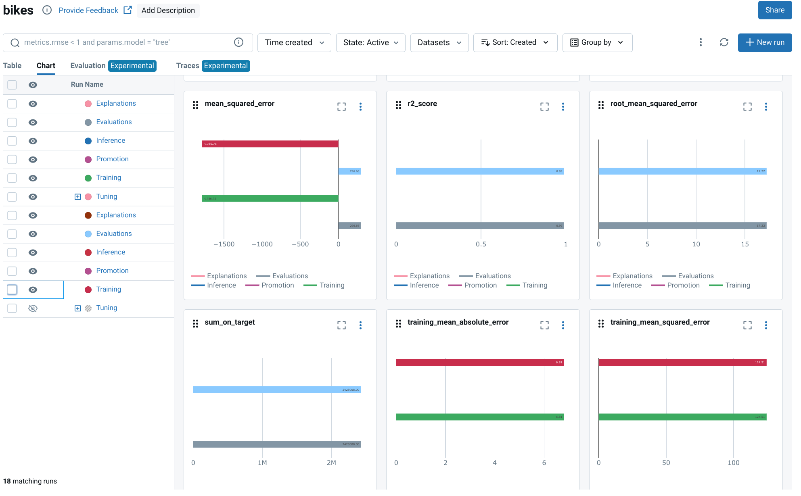

# 7.1. Monitoring

<iframe class="youtube" width="560" height="315" src="https://www.youtube.com/embed/yGvx7UOse-4?si=-hZ-RuWkxrLoh0aX" title="YouTube video player" frameborder="0" allow="accelerometer; autoplay; clipboard-write; encrypted-media; gyroscope; picture-in-picture; web-share" referrerpolicy="strict-origin-when-cross-origin" allowfullscreen></iframe>

## What is AI/ML Monitoring?

[AI/ML Monitoring](https://www.evidentlyai.com/ml-in-production/model-monitoring) is the practice of continuously tracking and evaluating the performance of machine learning models once they are deployed in a live environment. Unlike traditional software that fails loudly (e.g., by crashing), ML models can fail silently, providing plausible but incorrect results as data patterns change over time.

Effective monitoring is a cornerstone of MLOps, ensuring that models remain reliable, accurate, and fair throughout their lifecycle. It involves three primary activities:

- **Tracking Performance**: Continuously measuring predictive accuracy, data quality, and operational health metrics.
- **Detecting Drift**: Identifying statistical changes in input data or the relationship between inputs and outputs.
- **Triggering Alerts**: Automatically notifying stakeholders when performance degrades or key thresholds are breached, enabling timely intervention.

Without monitoring, a model's performance will inevitably decay, leading to poor business outcomes and a loss of trust in AI systems.

## How does AI/ML Monitoring differ from Traditional Software Monitoring?

While both disciplines aim to ensure system health, AI/ML monitoring addresses unique challenges rooted in the data-dependent nature of machine learning.

| Aspect | Traditional Software Monitoring | AI/ML Monitoring |
| :--- | :--- | :--- |
| **Core Logic** | Based on deterministic, human-written code. | Based on patterns learned from data, which can be non-intuitive. |
| **Failure Mode** | Fails loudly (e.g., crashes, errors, exceptions). | Fails silently (e.g., provides plausible but incorrect predictions). |
| **Primary Concern** | Application performance, uptime, and resource usage (CPU, memory). | Model performance, data quality, and drift, in addition to operational metrics. |
| **Root Cause** | Typically a bug in the code or an infrastructure issue. | Often caused by changes in the external world that are not reflected in the training data (i.e., drift). |

These differences require specialized tools and a shift in mindset from code-centric to data-and-model-centric monitoring.

## What are the key types of model drift?

Drift is the primary reason models fail over time. It occurs when the production data no longer resembles the data used to train the model. There are two main types:

1.  **Data Drift (or Feature Drift)**: This happens when the statistical properties of the model's input features change. For example, a fraud detection model trained on pre-pandemic transaction data may see its performance drop as consumer spending habits (e.g., frequency, amount, location) change in the post-pandemic era. The model's logic is still valid, but the input data is different.

2.  **Concept Drift**: This is a more fundamental change where the relationship between the input features and the target variable changes. For example, in a housing price prediction model, a change in interest rate policy could alter the relationship between features like square footage and the final sale price. Even if the input data distribution remains the same, the underlying concept the model learned has become obsolete.

## What are the Benefits of AI/ML Monitoring?

1.  **Prevent Performance Degradation**: Detect and address issues like model drift, data quality degradation, or biases before they negatively impact business outcomes.
2.  **Drive Continuous Improvement**: Use monitoring insights to identify when a model needs retraining, refinement, or replacement, creating a data-driven loop for model enhancement.
3.  **Ensure Business Continuity**: Safeguard against model failures and downtime, ensuring that AI-powered features remain stable, reliable, and available.
4.  **Build Stakeholder Trust**: Provide transparency into model performance and fairness, building confidence among users, customers, and executives.
5.  **Strengthen Governance and Compliance**: Maintain a clear audit trail of model behavior, which is essential for regulatory compliance and explaining model decisions.

## Which Metrics Should You Track for AI/ML Monitoring?

Effective monitoring requires tracking a balanced set of metrics across four key areas:

| Category | Example Metrics | Purpose |
| :--- | :--- | :--- |
| **Model Performance** | Accuracy, Precision, Recall, F1-Score, MAE, RMSE, AUC-ROC | Measures the predictive power and correctness of the model. |
| **Data Quality** | Data drift, missing values, outlier counts, data type mismatches | Detects changes in the input data that could invalidate model predictions. |
| **Business Impact** | Conversion rate, customer churn, revenue impact, click-through rate | Connects model performance directly to tangible business outcomes and ROI. |
| **Operational Health** | Prediction latency, throughput, CPU/memory usage, endpoint error rate | Assesses the health and efficiency of the model serving infrastructure. |

The right metrics depend on the model's use case and the business objectives it supports.

## How can you implement AI/ML Monitoring with MLflow?

The [MLOps Python Package](https://github.com/fmind/mlops-python-package) uses [Mlflow's `evaluate` API](https://mlflow.org/docs/latest/model-evaluation/index.html) to perform automated model validation, which is a key component of a robust monitoring strategy. This allows you to define performance thresholds and automatically flag models that do not meet the quality bar.

Here is how to implement this workflow:

1.  **Define Your Metrics**: Specify the metrics to track using the `SklearnMetric` class from the [`bikes.core.metrics` module](https://github.com/fmind/mlops-python-package/blob/main/src/bikes/core/metrics.py). This standardizes the evaluation criteria for your model.

    ```python
    from bikes.core import metrics

    # Define standard regression metrics
    metrics = [
        metrics.SklearnMetric(name="mean_squared_error", greater_is_better=False),
        metrics.SklearnMetric(name="r2_score", greater_is_better=True),
    ]
    ```

2.  **Establish Performance Thresholds**: Set minimum performance standards using the `Threshold` class. If a model's performance on a key metric falls below this threshold, the evaluation will fail, preventing a low-quality model from being promoted.

    ```python
    # A model is only valid if its R^2 score is 0.5 or higher
    thresholds = {
        "r2_score": metrics.Threshold(threshold=0.5, greater_is_better=True)
    }
    ```

3.  **Configure the Evaluation Job**: The `EvaluationsJob` in [`bikes.jobs.evaluations`](https://github.com/fmind/mlops-python-package/blob/main/src/bikes/jobs/evaluations.py) orchestrates the process. It loads the model, runs predictions on a test dataset, and calculates metrics against your defined thresholds.

    ```python
    from bikes import jobs
    from bikes.io import datasets

    evaluations_job = jobs.EvaluationsJob(
        inputs=datasets.ParquetReader(path="data/inputs_test.parquet"),
        targets=datasets.ParquetReader(path="data/targets_test.parquet"),
        metrics=metrics,
        thresholds=thresholds,
    )
    ```

4.  **Execute and Validate**: Running the job triggers the evaluation. If a threshold is breached, MLflow raises a `ModelValidationFailedException`, which can be caught in a CI/CD pipeline to automatically stop a deployment.

    ```python
    with evaluations_job as runner:
        runner.run()
    ```


## How to integrate AI/ML Monitoring to your data infrastructure?

You can use a specialized library like [Evidently](https://www.evidentlyai.com/) to generate interactive monitoring dashboards directly within a notebook or as part of an automated pipeline. Evidently excels at detecting data drift, monitoring model performance, and visualizing changes over time.

Here’s a simple workflow to generate a data drift report:

1.  **Install Evidently**:
    ```bash
    pip install evidently
    ```

2.  **Prepare Your Data**: You need two datasets: a `reference` dataset (e.g., the training or validation set) that represents the "expected" data distribution, and a `current` dataset (e.g., live production data from the last 24 hours) to compare against it.
    ```python
    import pandas as pd

    # Data the model was trained on
    reference_data = pd.read_csv('reference.csv')
    # Live data the model is currently seeing
    current_data = pd.read_csv('current.csv')
    ```

3.  **Generate the Report**: Create a report object, specify the metrics you want (e.g., `DataDriftPreset`), and run the analysis.
    ```python
    from evidently.report import Report
    from evidently.metric_preset import DataDriftPreset

    # Initialize a report and add a data drift metric preset
    report = Report(metrics=[DataDriftPreset()])
    report.run(reference_data=reference_data, current_data=current_data)

    # Display the interactive report in a notebook or save it as HTML
    report.show()
    # report.save_html('my_report.html')
    ```
This process creates a detailed report that helps you quickly diagnose if and how your production data has drifted from your reference data.

## What are the Best Practices for AI/ML Monitoring?

1.  **Monitor More Than Just Accuracy**: A comprehensive strategy includes data quality, drift, operational metrics, and business KPIs. A model can be accurate but slow, biased, or irrelevant to business goals.
2.  **Automate and Alert Intelligently**: Manual checks are not scalable. Build automated monitoring into your CI/CD and MLOps pipelines. Configure alerts that are actionable and directed to the right team to avoid alert fatigue.
3.  **Establish a Baseline**: Before deploying, establish a clear performance baseline on a holdout test set. All future monitoring will be relative to this baseline.
4.  **Visualize for Insight**: Use dashboards and visual reports to make monitoring data accessible to both technical and business stakeholders. A picture is worth a thousand data points.
5.  **Close the Loop**: Monitoring is not passive. Use the insights gained to trigger automated workflows for retraining, generating alerts for human review, or rolling back to a previous model version.
6.  **Review and Adapt**: Your monitoring strategy is not static. Regularly review your metrics, thresholds, and alerts to ensure they remain relevant as the model, data, and business requirements evolve.

## Additional Resources

- **[Example from the MLOps Python Package](https://github.com/fmind/mlops-python-package/blob/main/src/bikes/jobs/evaluations.py)**
- **[MLflow Evaluate API](https://mlflow.org/docs/latest/model-evaluation/index.html)**
- **[EvidentlyAI](https://www.evidentlyai.com/)**
- [Is AI/ML Monitoring just Data Engineering? 🤔](https://mlops.community/is-ai-ml-monitoring-just-data-engineering-%F0%9F%A4%94/)
- [Model Monitoring: What it is and why it's so hard](https://christophergs.com/machine%20learning/2020/03/14/how-to-monitor-machine-learning-models/)
