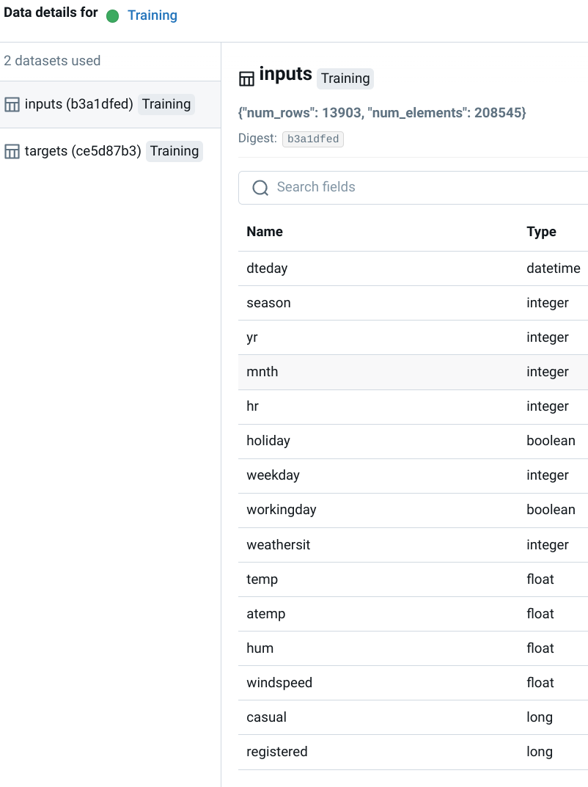

# 7.3. Lineage

## What is data and model lineage?

[Data and Model Lineage](https://en.wikipedia.org/wiki/Data_lineage) is the practice of tracking the complete lifecycle of data and models in a machine learning system. Think of it as a detailed audit trail that records where your data comes from, how it's transformed, how it's used to train models, and where those models are deployed.

This comprehensive record is essential for understanding, debugging, and trusting your AI/ML systems.

Key components of lineage tracking include:

- **Data Origin**: Pinpointing the source of the data, whether it's a database, API, or file system.
- **Data Transformations**: Recording every processing step, such as cleaning, feature engineering, and aggregation.
- **Model Training**: Capturing the specifics of the training process, including the exact data version, hyperparameters, and resulting model artifacts.
- **Model Deployment**: Tracking the deployment environment, version, and timeline of a model in production.

## Why is lineage a cornerstone of MLOps?

Effective data and model lineage provides several foundational benefits for mature MLOps practices:

1.  **Accelerated Debugging**: When a model underperforms or an error occurs, lineage allows you to instantly trace the problem back to its root cause, whether it's a faulty data source or a problematic transformation.
2.  **Robust Governance and Compliance**: Lineage creates a transparent, auditable record of data usage and model history, which is critical for meeting regulatory requirements like GDPR and ensuring ethical AI practices.
3.  **Guaranteed Reproducibility**: It provides a precise blueprint of the entire model creation process, enabling you to reliably reproduce experimental results, models, and predictions.
4.  **Proactive Impact Analysis**: Before implementing changes, you can use lineage to foresee the potential impact on downstream models and applications, preventing unexpected failures.

## What are the primary use cases for data lineage?

Data lineage provides critical insights that drive key activities within an ML project.

### Data Discovery and Understanding

Lineage simplifies the process of finding and understanding relevant datasets. By tracing a model's history, you can quickly identify its source data, explore its features, and see how it connects to other assets in your ecosystem. This accelerates new projects and helps validate data quality.

### Proactive Impact Analysis

Understanding the ripple effects of a change is vital for system stability. Lineage provides a map of data dependencies, allowing you to see which models will be affected if you alter a data source or feature engineering script. This enables you to retrain or re-validate models before issues arise in production.

### Streamlined Governance and Compliance

For industries with strict regulatory standards, lineage is non-negotiable. It provides an unimpeachable audit trail for data provenance, demonstrating that data is sourced, handled, and used in accordance with governance policies and legal requirements like GDPR.

### Pipeline Optimization

By visualizing the entire data flow, teams can identify bottlenecks, redundant processes, and opportunities for optimization. This leads to more efficient, cost-effective, and faster ML pipelines.

## What are the key challenges in implementing lineage?

While powerful, establishing a robust lineage system comes with challenges:

- **System Integration**: MLOps pipelines often involve diverse tools (e.g., Spark, dbt, MLflow). Integrating them to create a unified lineage graph can be complex.
- **Granularity**: Deciding on the right level of detail to track is a balancing act. Too little information is not useful, while too much can be overwhelming and costly to store.
- **Manual Effort**: While many tools automate parts of lineage capture, some steps, especially complex business logic within code, may require manual annotation.
- **Scalability**: As the number of datasets and models grows, the lineage graph can become massive and complex, requiring scalable infrastructure to manage and query it effectively.

## How to implement lineage tracking with MLflow?

The [MLOps Python Package](https://github.com/fmind/mlops-python-package) uses [MLflow's Dataset API](https://mlflow.org/docs/latest/python_api/mlflow.data.html) to seamlessly integrate lineage tracking into the experimentation workflow.

### Implementing Lineage in the MLOps Python Package

The implementation follows a clear, object-oriented pattern:

1.  **Abstracting Lineage Creation**: The `Reader` abstract base class in [`bikes.io.datasets`](https://github.com/fmind/mlops-python-package/blob/main/src/bikes/io/datasets.py) mandates a `lineage()` method, ensuring that any class responsible for reading data must also be capable of describing its origin.

    ```python
    import abc

    class Reader(abc.ABC):
        @abc.abstractmethod
        def lineage(
            self, name: str, data: pd.DataFrame, targets: str | None = None, predictions: str | None = None,
        ) -> Lineage:
    ```

2.  **Concrete Lineage Implementation**: The [`ParquetReader`](https://github.com/fmind/mlops-python-package/blob/main/src/bikes/io/datasets.py) class provides a concrete implementation. It uses `mlflow.data.from_pandas` to create an MLflow Dataset object, which captures the data's schema, source path, and other metadata.

    ```python
    import mlflow.data.pandas_dataset as lineage
    import pandas as pd

    class ParquetReader(Reader):
        # ... (other methods)

        @T.override
        def lineage(
            self, name: str, data: pd.DataFrame, targets: str | None = None, predictions: str | None = None,
        ) -> Lineage:
            return lineage.from_pandas(
                df=data, name=name, source=self.path, targets=targets, predictions=predictions
            )
    ```

3.  **Logging Lineage in Jobs**: During execution, jobs like [`TrainingJob`](https://github.com/fmind/mlops-python-package/blob/main/src/bikes/jobs/training.py) call the `lineage()` method and log the resulting object to MLflow. This automatically links the dataset to the run.

    ```python
    # In the TrainingJob's run() method
    inputs_lineage = self.inputs.lineage(data=inputs, name="inputs")
    mlflow.log_input(dataset=inputs_lineage, context=self.run_config.name)
    ```

### Visualizing Lineage in MLflow

The MLflow UI renders this information as an interactive graph, showing the flow of data from source to model. This makes it easy to understand dependencies and trace the history of any given run.



### Enhancing Lineage Tracking

To build a world-class lineage system, consider these best practices:

- **Log Transformations**: Use MLflow tags or parameters to record key data transformation steps.
- **Integrate Data Version Control**: Combine MLflow with tools like DVC to version your datasets, ensuring full reproducibility.
- **Document Feature Engineering**: Clearly document the logic and rationale behind feature creation to understand their impact on model behavior.
- **Connect to External Systems**: Use tools like OpenLineage to connect lineage information across different platforms (e.g., data warehouses, orchestration tools).

## Additional Resources

- **[Example from the MLOps Python Package](https://github.com/fmind/mlops-python-package/blob/main/src/bikes/io/datasets.py)**
- [MLflow Tracking Dataset](https://mlflow.org/docs/latest/tracking.html#tracking-datasets)
- [OpenLineage](https://openlineage.io/) and [Marquez](https://marquezproject.github.io/)
