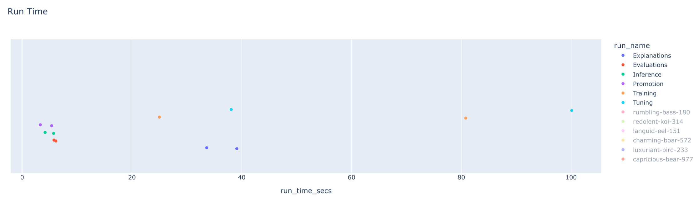
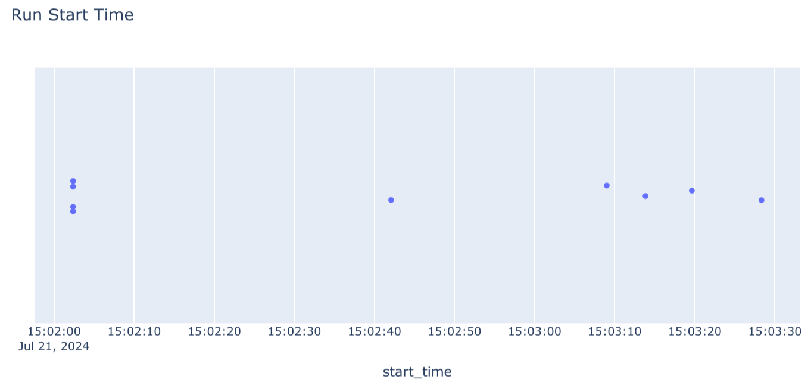
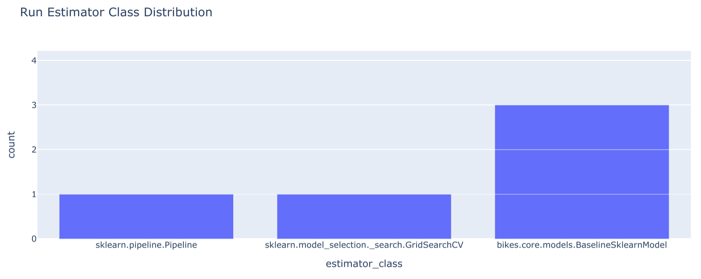

# 7.4. Costs and KPIs

## What are Costs and KPIs in the MLOps Lifecycle?

In MLOps, **Costs** represent the total financial investment required to bring a model from concept to production and maintain it. **[Key Performance Indicators (KPIs)](https://en.wikipedia.org/wiki/Performance_indicator)** are the quantifiable metrics used to measure the effectiveness and value of that investment.

### Breaking Down MLOps Costs

Costs are not just about computation. They span the entire lifecycle:

- **Infrastructure**: The price of using cloud resources (e.g., VMs, GPUs, storage) or on-premise hardware.
- **Data**: Expenses related to acquiring, labeling, cleaning, and storing datasets.
- **Personnel**: Salaries for the team of data scientists, ML engineers, and DevOps specialists.
- **Software & Tooling**: Licensing fees for ML platforms, libraries, and monitoring services.
- **Operational Overhead**: Ongoing expenses like network bandwidth, security, and maintenance.

### Understanding MLOps KPIs

KPIs provide a scorecard for your project, linking technical performance to business outcomes. They typically fall into these categories:

- **Model Quality**: How well the model performs its task (e.g., accuracy, [precision, recall, F1-score](https://towardsdatascience.com/accuracy-precision-recall-or-f1-331fb37c5cb9), [AUC](https://developers.google.com/machine-learning/crash-course/classification/roc-and-auc)).
- **Model Performance**: The model's operational efficiency (e.g., [inference latency](https://en.wikipedia.org/wiki/Latency_(engineering)), [throughput](https://en.wikipedia.org/wiki/Throughput), prediction speed).
- **Operational Stability**: The reliability of your ML system in production (e.g., [uptime](https://en.wikipedia.org/wiki/Uptime), error rate, resource utilization).
- **Business Impact**: The ultimate measure of success—the model's contribution to business goals (e.g., revenue generated, costs saved, customer churn reduction).

Effectively tracking both costs and KPIs is crucial for ensuring that MLOps initiatives are not just technically sound but also financially sustainable and aligned with strategic business objectives.

## Why is Tracking Costs and KPIs Mission-Critical?

Tracking costs and KPIs is not just good practice; it's essential for running a successful and sustainable MLOps program.

- **Drive Financial Accountability**: By understanding where every dollar is spent, you can justify budgets and demonstrate the financial viability of your projects.
- **Maximize Return on Investment (ROI)**: Identifying high-cost, low-return activities allows you to reallocate resources to areas that deliver the most value.
- **Enable Strategic Alignment**: KPIs ensure that your technical efforts are directly contributing to overarching business goals.
- **Pinpoint Inefficiencies**: Performance metrics act as a diagnostic tool, revealing bottlenecks in your data pipelines, training workflows, or deployment processes.
- **Foster Data-Driven Culture**: Hard data on costs and performance empowers your team to move beyond intuition and make decisions based on evidence.

## How Do You Perform a Quick "Back-of-the-Envelope" Cost Calculation?

A back-of-the-envelope calculation is a quick, informal estimate used for initial planning. While not precise, it provides a valuable baseline for project feasibility and budget discussions.

Let's estimate the training cost for a model on a cloud GPU instance.

**Scenario**: You need to train a deep learning model for 10 hours.

1.  **Identify the Resource**: You choose an AWS `p3.2xlarge` instance, which is suitable for deep learning.
2.  **Find the Price**: You look up the on-demand price for this instance. Let's assume it's **$3.06 per hour**.
3.  **Calculate the Core Cost**: Multiply the hourly rate by the training duration:
    - *Cost = Hourly Rate × Training Time*
    - *Cost = $3.06/hour × 10 hours = $30.60*
4.  **Factor in Other Costs (Optional but Recommended)**: Add estimates for data storage and transfer.
    - **Storage**: If your 100 GB dataset is stored for a month (e.g., on Amazon S3), and the cost is $0.023 per GB/month, that's an additional **$2.30**.
    - **Total Estimated Cost**: $30.60 (compute) + $2.30 (storage) = **$32.90**

This simple estimate helps you understand the primary cost drivers early on. As the project progresses, you can refine these numbers with more detailed monitoring.

## How Do You Select the Right KPIs for Your Project?

Choosing the right KPIs is about connecting your model's performance to your organization's strategic goals.

- **Start with Business Objectives**: Clearly define what the business wants to achieve. Is it to increase sales, reduce fraud, or improve operational efficiency?
- **Build a KPI Tree**: Deconstruct the high-level business objective into measurable drivers. For example, "increasing sales" might depend on "improving product recommendations," which is driven by the "click-through rate" of the recommendation model.
- **Balance Technical and Business Metrics**: A successful project requires both. A model with high accuracy (technical KPI) is only valuable if it also reduces customer churn (business KPI).
- **Focus on Actionable Metrics**: Choose KPIs that will trigger a specific action if they change. If latency increases, the action is to investigate the serving infrastructure.
- **Review and Adapt**: Business priorities shift. Regularly review your KPIs to ensure they remain relevant.

Here’s an expanded example of aligning KPIs with business goals:

| Business Goal                  | MLOps KPI                                                       | Measurement                                                                                   |
| ------------------------------ | --------------------------------------------------------------- | --------------------------------------------------------------------------------------------- |
| Increase online sales          | Click-through rate on product recommendations                   | (Number of clicks on recommendations / Number of times recommendations were shown)            |
| Reduce customer churn          | Customer churn rate after implementing a churn prediction model | (Number of customers who churned / Total number of customers)                                 |
| Improve operational efficiency | Model deployment time                                           | Time taken to deploy a new model version to production                                        |
| Minimize financial risk        | False positive rate in a fraud detection model                  | (Number of legitimate transactions flagged as fraud / Total number of legitimate transactions) |

## How Can You Translate MLflow Metrics into Costs and KPIs?

Tools like [MLflow](https://mlflow.org/) are excellent for tracking technical experiment metrics. The real value comes from translating this data into tangible costs and performance indicators. The [following notebook](https://github.com/fmind/mlops-python-package/blob/main/notebooks/indicators.ipynb) from the [MLOps Python Package](https://github.com/fmind/mlops-python-package) provides a practical guide.

### From Technical Metrics to Financial Costs

The notebook shows how to calculate `run_time`. This is your key to estimating compute costs.

- **Run Duration**: The difference between a run's start and end times gives you the compute duration.
- **Cost Calculation**: Multiply this duration by the known hourly cost of your infrastructure (e.g., the $3.06/hour for the `p3.2xlarge` instance).
- **Example**: If a training run in MLflow lasted 2.5 hours, the estimated cost is `2.5 hours * $3.06/hour = $7.65`.

By aggregating these costs across all runs in an experiment, you can accurately budget for and report on your projects.

### Interpreting Visualizations for Actionable Insights

The dashboards created in the notebook are not just charts; they are decision-making tools.

- **Run Time per Experiment**: The strip chart for `run_time` immediately shows which model types or experiments are most expensive. If "tuning" runs consistently take longer than "training" runs, you can investigate optimizing your hyperparameter search space.

- **Run Start Times**: This chart helps visualize your team's activity and resource usage patterns. Are GPUs sitting idle overnight? This could be an opportunity to schedule automated jobs and improve resource utilization.

- **Estimator Distribution**: This bar chart reveals which algorithms are most frequently used. If your team heavily relies on a specific, computationally expensive model (e.g., XGBoost), you can focus optimization efforts there or explore lighter-weight alternatives for less critical tasks.

### Connecting to Business KPIs

To make MLflow truly powerful, you must log metrics that matter to the business.

1.  **Define Business KPIs**: Work with stakeholders to define relevant metrics. For a churn prediction model, this could be `customer_retention_lift`.
2.  **Log KPIs in MLflow**: During evaluation, calculate and log this metric using `mlflow.log_metric("customer_retention_lift", 0.15)` to record a 15% improvement.
3.  **Analyze and Report**: Retrieve these business-facing KPIs alongside your technical metrics. This allows you to create a comprehensive report showing not just that the model is accurate, but that it's delivering real business value.

By systematically linking technical data from MLflow to financial costs and business KPIs, you elevate the conversation from code and algorithms to strategy and impact.

## What Are Common Pitfalls in Tracking MLOps KPIs?

Tracking KPIs is powerful, but several common mistakes can undermine its effectiveness:

- **Focusing Solely on Model Accuracy**: A model can be 99% accurate but fail on the small subset of cases that are most important to the business. Always balance accuracy with business-relevant metrics.
- **Ignoring Data Pipeline Costs**: The cost of running, monitoring, and debugging data ingestion and transformation pipelines can often exceed model training costs. Ensure these are included in your total cost of ownership.
- **Forgetting Inference Costs**: Training is often a one-time or infrequent cost, but inference can be a continuous, high-volume expense, especially for real-time services. Model your inference costs carefully.
- **Using Vanity Metrics**: Avoid metrics that look good on paper but don't drive action or reflect true performance. For example, "number of models trained" is less important than "number of models successfully deployed and delivering value."
- **Failing to Communicate**: KPIs are only useful if they are understood by stakeholders. Create dashboards tailored to different audiences (technical vs. executive) and communicate the story behind the numbers.

## What Tools Can Help Monitor Cloud Costs?

While MLflow tracks experiment metrics, dedicated cloud cost management tools provide a higher-level view of infrastructure spending.

- **Resource Tagging**: The most critical practice is to **tag** all your cloud resources (VMs, storage buckets, databases) with project names, team names, or environment (e.g., `project: churn-prediction`, `env: prod`).
- **Cloud-Native Tools**:
  - **AWS Cost Explorer**: A free tool within the AWS console to visualize, understand, and manage your AWS costs and usage over time.
  - **Azure Cost Management + Billing**: Provides similar capabilities for analyzing and optimizing spending on Microsoft Azure.
  - **Google Cloud Cost Management**: Offers tools to monitor, control, and optimize your costs on GCP.

By combining detailed experiment data from MLflow with high-level spending data from these tools, you gain a complete picture of your MLOps financial footprint.

## Additional Resources

- **[Example from the MLOps Python Package](https://github.com/fmind/mlops-python-package/blob/main/notebooks/indicators.ipynb)**
- [MLflow Tracking](https://mlflow.org/docs/latest/tracking.html)
- [How to Estimate ROI for AI and ML Projects](https://www.phdata.io/blog/how-to-estimate-roi-for-ai-ml-projects/)
