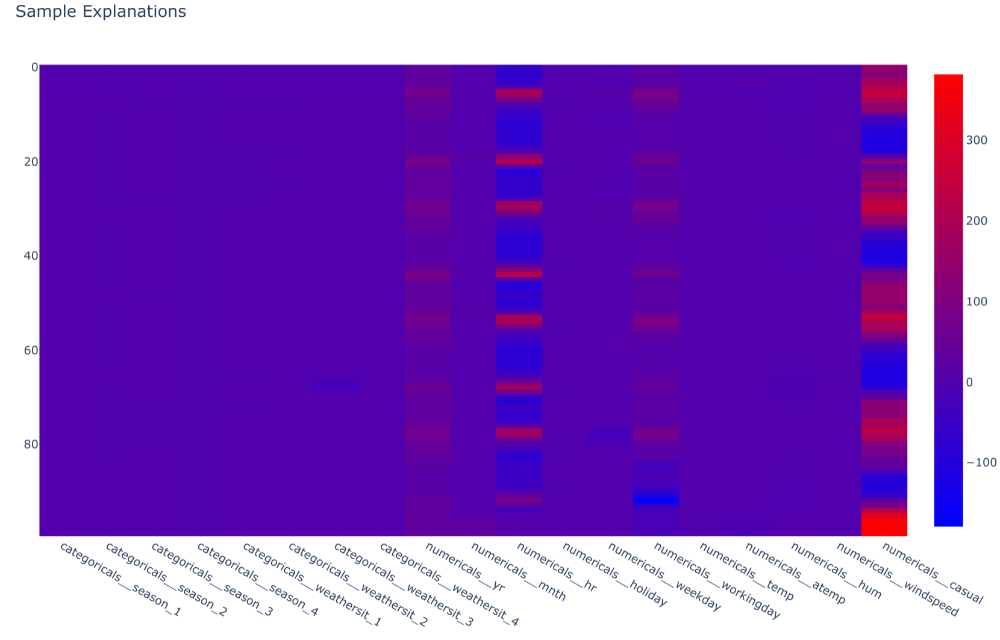

# 7.5. Explainability

## What is Explainability in AI/ML?

[Explainability in Artificial Intelligence and Machine Learning (AI/ML)](https://christophm.github.io/interpretable-ml-book/) is the practice of making a model's decision-making process understandable to humans. As models grow in complexity, their inner workings can become "black boxes." Explainability opens these boxes, revealing *why* a model made a specific prediction or decision. This is essential for building responsible AI systems, especially in high-stakes fields like healthcare and finance, as it enables transparency, accountability, and trust.

## Why is Explainability crucial in AI/ML?

- **Build Trust**: For stakeholders and users to trust an AI system, they must understand its reasoning. Explainability provides the transparency needed to build that confidence.
- **Debug and Improve Models**: When a model makes an incorrect prediction, explainability helps pinpoint the cause, enabling faster debugging and more effective model refinement.
- **Detect and Mitigate Bias**: Explainability methods can uncover hidden biases in data or model logic, allowing you to build fairer and more equitable systems.
- **Ensure Regulatory Compliance**: Many industries have regulations requiring that decisions be justifiable. Explainability provides the evidence needed to meet these legal and ethical standards.

## What is the difference between Local and Global Explainability?

Explainability techniques are typically categorized by their scope:

- **[Local Explainability](https://censius.ai/blogs/global-local-cohort-explainability#blogpost-toc-13)**: Explains a *single* prediction. It answers the question: "Why did the model make this specific decision for this particular input?" This is vital for analyzing individual cases, such as understanding why a specific customer's loan application was denied.
    - **Example**: [SHAP (SHapley Additive exPlanations)](https://shap.readthedocs.io/en/latest/) calculates the impact of each feature on an individual prediction, showing which factors pushed the prediction higher or lower.

- **[Global Explainability](https://censius.ai/blogs/global-local-cohort-explainability#blogpost-toc-11)**: Explains the *overall* behavior of a model across the entire dataset. It answers the question: "What are the most important features driving the model's predictions in general?" This is useful for understanding the model's core logic.
    - **Example**: Feature importance plots from tree-based models provide a global view by ranking features based on their average contribution to the model's accuracy.

Effective model analysis often requires both: global explainability to understand the general strategy of the model and local explainability to audit and trust individual outcomes.

## What is the trade-off between performance and explainability?

A fundamental challenge in AI/ML is the trade-off between a model's predictive power and its interpretability.

- **High-Performance Models (e.g., Deep Neural Networks, Gradient Boosting)**: These models often achieve state-of-the-art accuracy by learning highly complex, non-linear patterns in the data. However, this complexity makes their internal logic opaque, turning them into "black boxes."
- **High-Explainability Models (e.g., Linear Regression, Decision Trees)**: These models follow simpler, more transparent rules. It's easy to inspect their coefficients or decision paths to understand how they work, but they may not capture complex relationships in the data, potentially leading to lower accuracy.

The goal in MLOps is not always to choose one over the other but to find the right balance for the specific application. For a high-stakes domain like medical diagnosis, a slightly less accurate but fully transparent model might be preferable. For a low-risk application like product recommendations, a high-performance black-box model might be acceptable, supplemented with techniques like SHAP to provide post-hoc explanations.

## How can you implement Explainability with SHAP?

The [MLOps Python Package](https://github.com/fmind/mlops-python-package) provides a practical template for integrating both global and local explainability into a project. It uses a dedicated [`ExplanationsJob`](https://github.com/fmind/mlops-python-package/blob/main/src/bikes/jobs/explanations.py) that leverages Random Forest for global feature importance and SHAP for local, sample-specific explanations.

Here’s a breakdown of the implementation:

1.  **Global Explainability (`explain_model`)**: The `explain_model` method in the `Model` class provides global insights. The implementation for the `BaselineSklearnModel` extracts the `feature_importances_` attribute from the trained RandomForestRegressor, giving a high-level view of which features matter most across all predictions.

    ```python
    class BaselineSklearnModel(Model):
        # ... (other methods)

        @T.override
        def explain_model(self) -> schemas.FeatureImportances:
            model = self.get_internal_model()
            regressor = model.named_steps["regressor"]
            transformer = model.named_steps["transformer"]
            feature_names = transformer.get_feature_names_out()
            feature_importances = schemas.FeatureImportances(
                data={
                    "feature": feature_names,
                    "importance": regressor.feature_importances_,
                }
            )
            return feature_importances
    ```

    

2.  **Local Explainability (`explain_samples`)**: This method delivers local, instance-level explanations. It uses a `shap.TreeExplainer` to calculate the SHAP values for a given set of input samples. The output shows how each feature contributed to each individual prediction, enabling deep dives into specific model decisions.

    ```python
    class BaselineSklearnModel(Model):
        # ... (other methods)

        @T.override
        def explain_samples(self, inputs: schemas.Inputs) -> schemas.SHAPValues:
            model = self.get_internal_model()
            regressor = model.named_steps["regressor"]
            transformer = model.named_steps["transformer"]
            transformed_inputs = transformer.transform(X=inputs)
            explainer = shap.TreeExplainer(model=regressor)
            shap_values = schemas.SHAPValues(
                data=explainer.shap_values(X=transformed_inputs),
                columns=transformer.get_feature_names_out(),
            )
            return shap_values
    ```

    

3.  **Orchestration (`ExplanationsJob`)**: This job ties everything together. It loads a registered model from MLflow, prepares a data sample, and calls the `explain_model` and `explain_samples` methods. The resulting explanations are saved as Parquet files for later analysis, visualization, or reporting.

    ```python
    class ExplanationsJob(base.Job):
        # ... (other attributes)

        def run(self):
            # ... (logic for loading model and data)
            # Global explanations
            logger.info("Generating global model explanations...")
            model_explanations = model.explain_model()
            logger.debug("Global explanations shape: {}", model_explanations.shape)

            # Local explanations
            logger.info("Generating local explanations for {} samples...", len(inputs_samples))
            sample_explanations = model.explain_samples(inputs=inputs_samples)
            logger.debug("Local explanations shape: {}", sample_explanations.shape)

            # ... (write explanations to files)
    ```

### Integrating Explainability into Your Workflow

By running the `ExplanationsJob` after model training, you can systematically generate and store explanations. These artifacts are invaluable for:

- **Model Audits**: Analyzing feature importances to validate model behavior against domain knowledge.
- **Fairness Checks**: Investigating if predictions for certain demographics are disproportionately influenced by sensitive features.
- **Error Analysis**: Drilling down into the explanations for misclassified samples to understand failure modes.
- **Stakeholder Communication**: Using clear visualizations to explain model decisions to non-technical audiences.

## What are common challenges in AI explainability?

While powerful, explainability methods are not a silver bullet and come with their own set of challenges:

- **Computational Cost**: Techniques like SHAP can be computationally expensive, especially for large datasets and complex models, making them difficult to integrate into real-time prediction pipelines.
- **Misinterpretation**: Explanations can be misleading if not interpreted correctly. A feature with a high SHAP value is influential, but this doesn't automatically imply a causal relationship. Users must be trained to understand the nuances of these tools.
- **Fidelity vs. Interpretability**: An explanation is only useful if it accurately reflects the model's behavior (high fidelity). However, sometimes the most faithful explanations are themselves complex and hard to understand, defeating the purpose.
- **"Explaining Away" Bad Behavior**: There's a risk that teams might use explainability tools to justify or rationalize a biased or flawed model rather than using them to identify and fix the underlying issues.

## Which sectors are most impacted by Explainable AI?

Explainable AI is critical in any sector where automated decisions have significant consequences for individuals or where regulatory oversight is strong. Key examples include:

- **Banking and Finance**: To justify credit scoring, loan approvals, and fraud detection, ensuring fairness and compliance with regulations like the Equal Credit Opportunity Act.
- **Healthcare**: For clinicians and patients to trust AI-driven diagnoses, treatment plans, and risk assessments. Explainability is vital for adoption and safety.
- **Insurance**: To provide transparent reasoning for premium calculations, risk assessments, and claim processing, avoiding discriminatory practices.
- **Criminal Justice**: When AI is used in areas like predictive policing or assessing recidivism risk, explainability is a fundamental requirement for ensuring ethical and legal accountability.

## Additional Resources

- **[Explainability example from the MLOps Python Package](https://github.com/fmind/mlops-python-package/blob/main/src/bikes/jobs/explanations.py)**
- [SHAP (SHapley Additive exPlanations)](https://shap.readthedocs.io/en/latest/)
- [LIME (Local Interpretable Model-agnostic Explanations)](https://github.com/marcotcr/lime)
- [Interpretable Machine Learning: A Guide for Making Black Box Models Explainable](https://christophm.github.io/interpretable-ml-book/)
- [Explainable AI (XAI): Concepts, Taxonomies, Opportunities and Challenges toward Responsible AI](https://arxiv.org/abs/1910.10045)
