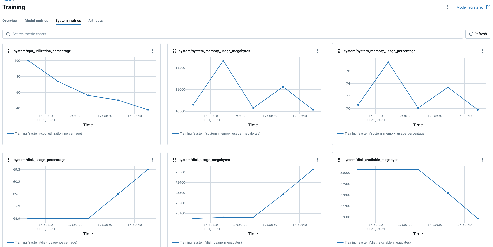

# 7.6. Infrastructure

## What is Infrastructure Monitoring in MLOps?

[Infrastructure Monitoring in MLOps](https://cloud.google.com/architecture/mlops-continuous-delivery-and-automation-pipelines-in-machine-learning) is the practice of continuously tracking the performance and utilization of the hardware resources—such as CPU, memory, and GPUs—that power your machine learning workloads. By collecting and analyzing these metrics, you gain critical visibility into the operational health, efficiency, and stability of your entire MLOps pipeline, from model training to production inference.

## Why is Infrastructure Monitoring crucial for AI/ML workloads?

Monitoring your hardware is essential for building robust, efficient, and cost-effective AI/ML systems. Key benefits include:

- **Cost Control**: Identify and eliminate waste, such as idle GPUs or over-provisioned CPUs, to significantly reduce cloud computing bills.
- **Performance Optimization**: Pinpoint hardware bottlenecks that slow down model training or inference, allowing you to tune your infrastructure for maximum speed.
- **Enhanced Reliability**: Proactively detect issues like memory leaks or impending disk space shortages to prevent unexpected crashes during critical, long-running jobs.
- **Informed Scalability**: Analyze resource consumption trends to accurately forecast future needs, ensuring your infrastructure can scale to handle larger datasets and more complex models without failure.

Ultimately, effective monitoring transforms your infrastructure from a black box into a transparent, predictable, and optimized asset.

## What key metrics should you monitor?

While the specific metrics depend on your workload, several are universally critical for MLOps:

- **CPU Utilization**: High CPU usage often points to bottlenecks in data preprocessing or feature engineering pipelines.
- **Memory (RAM) Usage**: Essential for handling large datasets. Sudden spikes can be an early warning of out-of-memory errors that could crash your training jobs.
- **GPU Utilization & Memory**: Often the most expensive resource. Low utilization indicates that your code is not efficiently leveraging the GPU, wasting both time and money. High GPU memory usage can limit model complexity or batch sizes.
- **Disk I/O (Input/Output)**: Slow disk access can become a major bottleneck, especially when training on datasets that are too large to fit in memory.
- **Network Bandwidth**: Crucial for distributed training environments or when fetching data from remote storage like a cloud bucket.

## How can you implement Infrastructure Monitoring with MLflow?

The [MLOps Python Package](https://github.com/fmind/mlops-python-package) utilizes [MLflow's system metrics](https://mlflow.org/docs/latest/system-metrics/index.html) feature to provide an excellent starting point for infrastructure monitoring. It automatically captures hardware performance metrics during job execution, linking resource consumption directly to specific MLflow runs.

Here’s how to enable it:

1.  **Enable System Metrics Logging**: In your job’s configuration, set `log_system_metrics=True` in the `RunConfig` for the `MlflowService`.

    ```python
    from bikes.io import services

    run_config = services.MlflowService.RunConfig(
        name="Training", log_system_metrics=True
    )

    training_job = jobs.TrainingJob(
        ...,
        run_config=run_config,
    )
    ```

2.  **Execute Your Job**: Run the job as you normally would. MLflow will now automatically log system metrics in the background.

3.  **Analyze Metrics in the MLflow UI**: Navigate to the MLflow UI to find the logged metrics. These charts provide a clear view of CPU utilization, memory usage, and other key details, helping you assess the hardware demands of your model.



### Customizing MLflow System Metrics

[MLflow's system metrics](https://mlflow.org/docs/latest/system-metrics/index.html) offer further customization to fit your needs. You can:

- **Adjust the Collection Interval**: Control the sampling frequency to balance data granularity with storage overhead.
- **Select Specific Metrics**: Choose which metrics to track to focus on what matters most for your analysis.
- **Export for Deeper Analysis**: Send the logged metrics to external monitoring systems for more advanced visualization and alerting.

## When should you use advanced monitoring tools?

While MLflow is perfect for experiment-level insights, you need dedicated platforms for production-grade, long-term monitoring. These tools offer more power, flexibility, and scalability.

- **[Prometheus](https://prometheus.io/)**: The open-source standard for time-series metric collection. It periodically "pulls" metrics from your applications and services, making it highly reliable for system-wide monitoring.
- **[Grafana](https://grafana.com/)**: The premier open-source tool for visualizing and dashboarding data. It pairs perfectly with Prometheus to create powerful, shareable dashboards that provide a comprehensive view of your infrastructure's health.
- **[Datadog](https://www.datadoghq.com/)**: A leading commercial platform that unifies metrics, traces, and logs in a single, easy-to-use interface. It offers a faster setup and broader range of integrations than a self-hosted stack, making it a popular choice for teams who prefer a managed solution.

## Additional Resources

- **[Example from the MLOps Python Package](https://github.com/fmind/mlops-python-package/blob/main/src/bikes/io/services.py)**
- [MLflow System Metrics](https://mlflow.org/docs/latest/system-metrics/index.html)
- [Datadog](https://www.datadoghq.com/)
- [Prometheus](https://prometheus.io/)
- [Grafana](https://grafana.com/)
