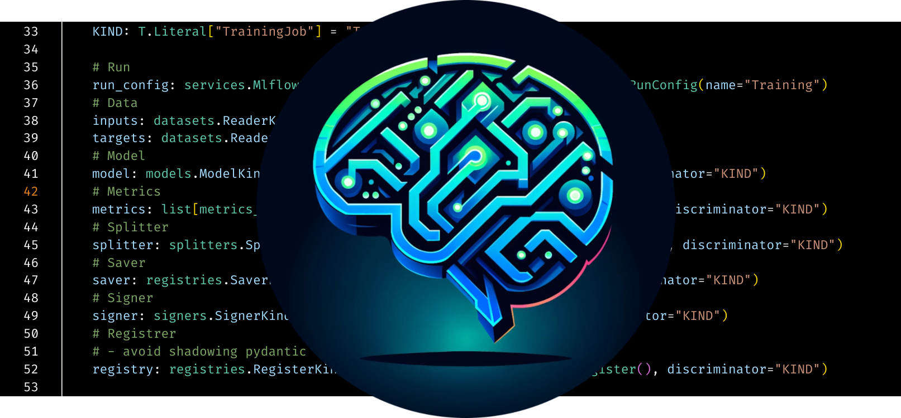

# MLOps Coding Course

    
     
    *Learn how to create, develop, and maintain a state-of-the-art MLOps code base.*

Welcome to the MLOps Coding Course, where we bridge the gap between robust software engineering and cutting-edge data science. This course is tailored for developers and data scientists aiming to master the art of building, deploying, and maintaining production-grade AI/ML systems in Python. Through a hands-on, project-based approach, you will gain the practical skills needed to excel in a real-world MLOps environment.

- **Donation Link**: [https://donate.stripe.com/4gw8xT9oVbCc98s7ss](https://donate.stripe.com/4gw8xT9oVbCc98s7ss){target="_blank"}
- **GitHub Repository**: [https://github.com/MLOps-Courses/mlops-coding-course](https://github.com/MLOps-Courses/mlops-coding-course){target="_blank"}
- **MLOps Coding Assistant**: [https://mlops-coding-assistant.fmind.dev/](https://mlops-coding-assistant.fmind.dev/){target="_blank"}

<iframe class="youtube" width="560" height="315" src="https://www.youtube.com/embed/M0icwL3gjL8?si=TzN9Pt3hNgUP0KH5" title="YouTube video player" frameborder="0" allow="accelerometer; autoplay; clipboard-write; encrypted-media; gyroscope; picture-in-picture; web-share" referrerpolicy="strict-origin-when-cross-origin" allowfullscreen></iframe>

## [Chapter 0: Overview](./0. Overview/)

This chapter provides a high-level overview of the MLOps landscape and the course structure. We will define core concepts, outline our learning objectives, and set the stage for the technical skills you will acquire.

## [Chapter 1: Initializing](./1. Initializing/)

A solid foundation is critical. This chapter guides you through setting up a professional development environment with the essential tools for Python-based MLOps projects. A proper setup ensures a streamlined workflow and prevents common configuration issues.

## [Chapter 2: Prototyping](./2. Prototyping/)

In this chapter, we explore the prototyping phase, where ideas are transformed into initial models. You will learn to use notebooks and other tools to efficiently experiment, analyze data, and validate hypotheses before committing to a final design.

## [Chapter 3: Productionizing](./3. Productionizing/)

Move your projects from prototype to production. This chapter focuses on structuring your Python code for scalability and maintainability. We cover key topics like creating installable packages, applying software design paradigms, and optimizing your development workflow.

## [Chapter 4: Validating](./4. Validating/)

Ensure the quality and reliability of your machine learning pipelines. This chapter covers essential validation techniques, including static typing, linting, testing, and debugging. These practices are fundamental for building robust, scalable, and collaborative MLOps systems.

## [Chapter 5: Refining](./5. Refining/)

Take your MLOps projects to the next level. This chapter delves into advanced refinement techniques to improve efficiency, reliability, and scalability. We will explore design patterns, task automation, pre-commit hooks, and CI/CD workflows to streamline your development process.

## [Chapter 6: Sharing](./6. Sharing/)

Learn to effectively share and distribute your MLOps projects. This chapter covers best practices for packaging, documenting, and versioning your work to enhance collaboration, promote code reuse, and scale your machine learning solutions across teams.

## [Chapter 7: Observability](./7. Observability/)

Gain deep insights into your deployed models and infrastructure. This chapter covers the critical aspects of observability, including reproducibility, monitoring, alerting, data lineage, cost management, model explainability, and infrastructure performance.

## Let's journey together!

Embark on your journey to mastering MLOps. By completing this course, you will possess the skills and confidence to design, build, and manage complex machine learning systems professionally. Let’s begin!
